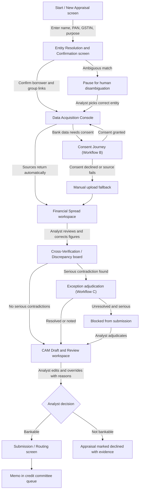
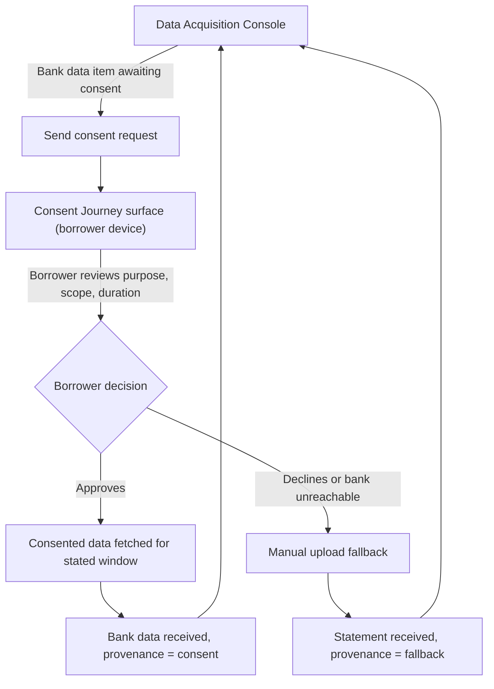
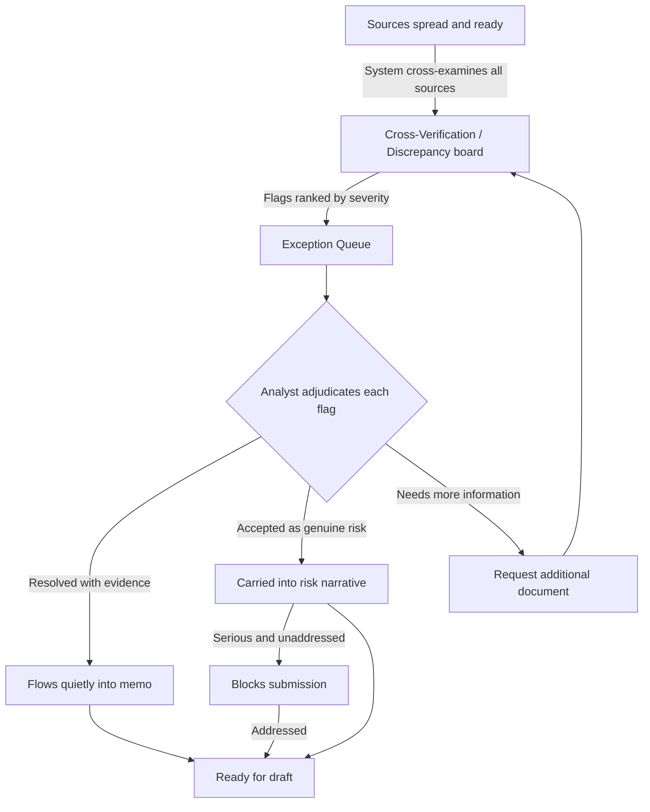
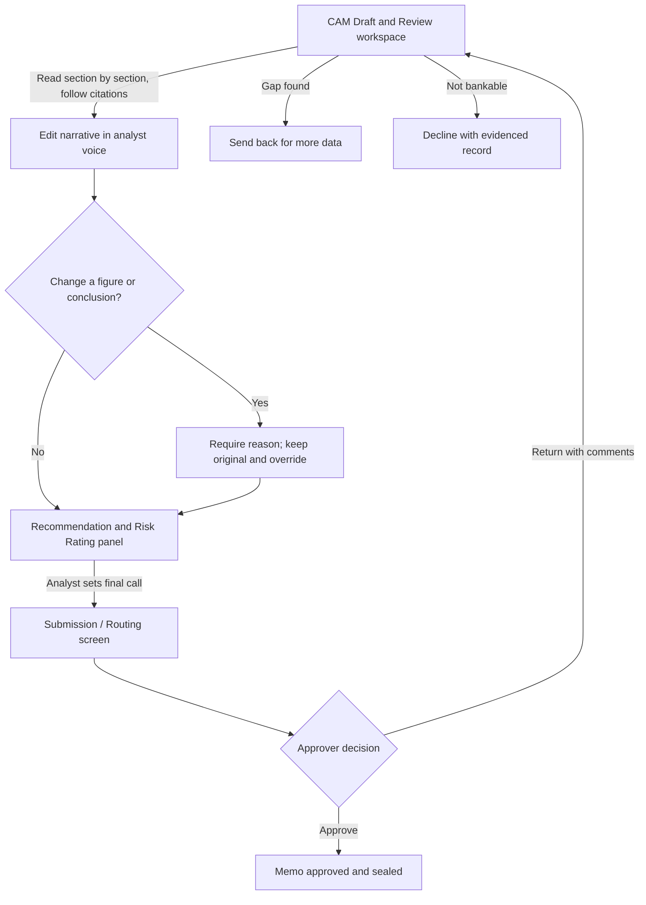
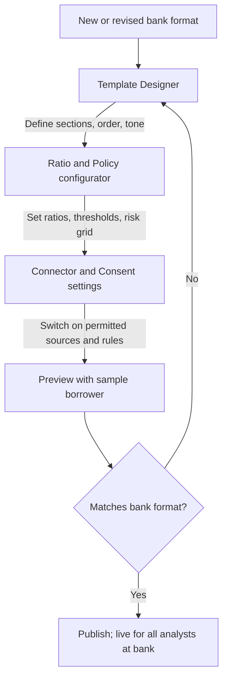
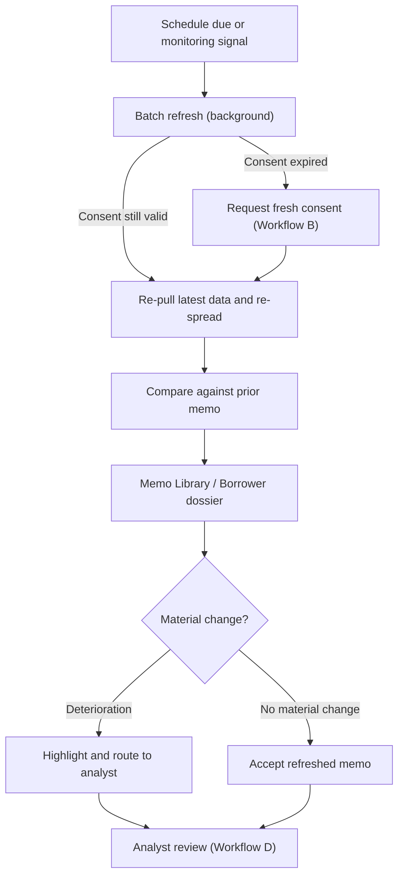
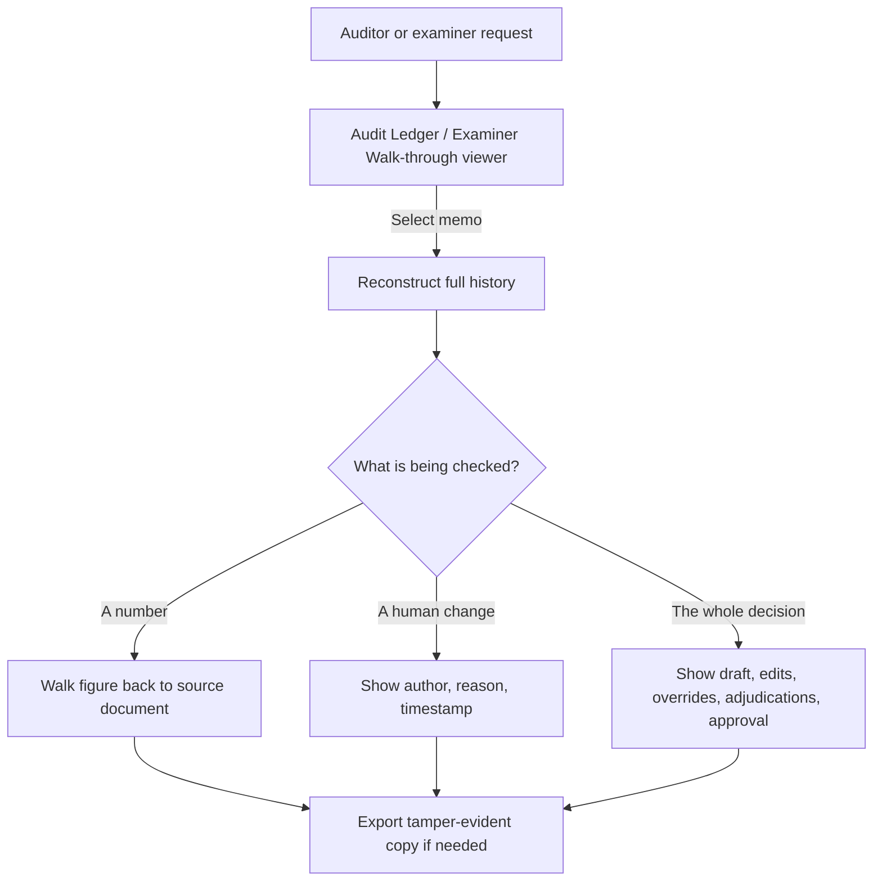

# CreditIQ

### Functional Product Specification

**Identifier-to-CAM Automation Platform for Commercial Lending**

Version 1.0 (functional draft for build team)

---

## 0. How to read this document

This is a functional specification. It describes **what** the product does, **who** uses it, and **why** each part exists. It deliberately does not describe how to build any of it: there are no schemas, no field lists, no data models, no interface contracts, and no implementation instructions. Where architecture is discussed, it is discussed as shape and intent only, never as a mandate about components or technologies.

A reader with no background in banking or in this product should be able to open any single section and understand who is on screen, what they are trying to do, what the system does in response, and what changes in the world when they finish. Named people and companies in the scenarios (Meera, Rajat, "Sunrise Textiles Pvt Ltd", "Vista Commercial Bank") are fictional and exist only to make the flows concrete.

The document is one continuous story. The personas introduced in Section 4 are the same people who appear in the workflows in Section 5; the screens named in Section 5 are catalogued in Section 6; the capabilities in Section 7 are what make those screens work; and the obligations in Section 11 are the reason certain steps in Section 5 exist at all.

---

## 1. Product Overview

### 1.1 What it is

CreditIQ is a decision-support platform for the credit teams of commercial banks. Its single promise is simple to state: a credit analyst types in the bare minimum needed to identify a business borrower, being the borrower's name together with its PAN and its GST identification number, and CreditIQ returns a complete, evidence-backed **Credit Appraisal Memorandum** drafted in that bank's own house format, ready for the analyst to review, correct, and sign.

A Credit Appraisal Memorandum (from here on, "CAM") is the internal case file a bank's credit team prepares before it sanctions or declines a loan to a business. It is the document the credit committee reads to decide whether the borrower can repay. It pulls together the borrower's background, several years of financial statements, the ratios the bank underwrites on, the borrower's conduct with other lenders, and the analyst's own risk assessment and recommendation. Today this file is assembled by hand from a scatter of disconnected sources, and a single memo can take an analyst anywhere from a day to two weeks depending on the borrower's complexity.

CreditIQ compresses that assembly work from days into a short review session, without removing the analyst from the decision. The analyst still owns the memo. CreditIQ does the fetching, the spreading, the cross-checking, and the first draft; the human does the judging.

### 1.2 Who it is for

The direct users are the people inside a bank's wholesale and mid-market credit function: the credit analysts who write memos, the relationship managers who bring in the borrower, the credit managers and committee members who approve them, and the credit-risk and audit leadership who are accountable for how those decisions were made. A borrower never logs in, but the borrower is present in one important moment: when the borrower grants digital consent for the bank to see its bank-account data. Section 4 describes each of these people in detail.

### 1.3 The problem it solves

Three problems, stacked on top of each other.

The first is **time**. Credit teams report spending a large share of their working hours writing memos rather than analysing credit. When a bank's wholesale lending book is growing quickly, memo volume outruns analyst capacity, and slow turnaround becomes a commercial liability, because corporate borrowers shop their proposals between banks and the slower bank loses the deal.

The second is **blind spots**. A memo built from a single source is dangerous. A borrower can show healthy declared turnover in its tax filings while its bank account tells a very different story; a borrower can declare a modest monthly loan obligation while its account shows far larger recurring payments to lenders it never disclosed. The insight that protects the bank lives in the **gap between sources**, and that gap only appears when someone deliberately lines the sources up against each other. Under manual preparation, tired analysts under deadline pressure often do not.

The third is **inconsistency and defensibility**. Two analysts given the same borrower produce two different memos of two different qualities. And when a regulator or internal auditor later asks why a loan was made, the bank needs to be able to reconstruct exactly what evidence supported each number. Hand-assembled memos rarely carry that evidence trail.

CreditIQ attacks all three: it removes the assembly time, it makes cross-source contradiction a first-class output rather than an afterthought, and it makes every figure in the memo traceable to the document it came from.

### 1.4 Core design principles (summary)

These are stated fully in Section 3, but the whole product rests on them, so they belong up front. CreditIQ **augments the analyst, it does not replace the credit decision**. Every number it produces is **traceable to its source**. It **triangulates** rather than trusting any single input. It treats **the discrepancy, not the speed, as the real product**. It handles borrower data **only with consent and only for the stated purpose**. It renders output in **the bank's own format**, never a generic one. And everything it does is **reconstructable after the fact**, so the bank can always answer the question "why did we lend?"

---

## 2. Architecture Overview (conceptual)

This section describes the shape of the system in plain language. It names no components and mandates no technologies. It exists so a build team understands the major moving parts and how they relate before any of them is designed.

### 2.1 Two planes

It helps to think of CreditIQ as two cooperating planes.

The **control plane** is where the bank sets the rules and where the platform governs itself. Here a bank defines what its CAM looks like, which ratios it underwrites on and at what thresholds, what its risk-rating grid is, who is allowed to author versus approve, which data sources are switched on, and how long data is kept. The control plane also holds the platform's memory of everything that happened: an immutable record of what was produced, what a human changed, and why. The control plane is slow-moving and administrative. It is configured once per bank and adjusted occasionally.

The **data plane** is where the work happens for a single borrower. Here an identifier becomes a resolved borrower, a resolved borrower becomes a pile of fetched and extracted evidence, that evidence becomes a normalised financial picture, that picture is cross-examined for contradictions, and the whole thing becomes a drafted memo. The data plane is fast-moving and runs many times a day, once per appraisal.

The clean separation matters because it is what lets one product serve many banks. The data plane behaves the same way everywhere; the control plane is what makes the output come out looking like *this* bank's memo rather than *that* bank's.

### 2.2 A team of specialists under a supervisor

Inside the data plane, the work is best understood as a small team of specialist workers coordinated by a supervisor, with a human checkpoint at the end. One worker specialises in resolving identity. Another specialises in gathering data from each source. Another specialises in reading documents and turning them into structured numbers. Another specialises in spreading those numbers and computing ratios. Another specialises in the cross-examination that finds contradictions. Another specialises in writing the narrative sections of the memo in the bank's voice. A supervisor sequences them, decides when a worker's output is confident enough to pass along and when it needs to be flagged for a human, and assembles the finished draft.

This "team of specialists" is a conceptual description of behaviour, not a build instruction. The point the build team should take from it is that the work is **decomposable and supervised**: each stage produces a checkable intermediate result, and the human can inspect any stage, not just the final memo. This is deliberate. It is what makes the output explainable and auditable, which Section 11 requires.

### 2.3 How it sits alongside the bank's existing tools

CreditIQ is a companion to the bank's lending systems, not a replacement for them. It reads from what the bank already knows about an existing customer (past conduct, existing exposure) and it deposits its finished memo back where the bank's approval process expects to find it. It never becomes the system of record for the lending decision itself; the bank's own origination and sanctioning machinery remains that. CreditIQ is the intelligence layer that prepares the case, hands it to a human, and then steps aside.

### 2.4 Modes of operation

CreditIQ runs in three modes. **On-demand** is the default: an analyst asks for one memo for one borrower, now. **Batch refresh** is periodic: a whole portfolio of existing borrowers is re-appraised on a schedule so that memos stay current. **Assisted review** is the human-facing mode that overlays both: the surface where a person reads a draft, follows every citation, edits, overrides with a reason, and signs.

### 2.5 Deployment is a choice, not a fixture

The two planes can be delivered in more than one way (fully inside a single bank's environment, or as a shared multi-bank service with strict separation between banks). Section 10 treats these as options to be chosen, not as anything fixed here.

---

## 3. Design Principles and Product Philosophy

These are the non-negotiable beliefs. Every screen and every flow in this document can be traced back to one of them. If a future design choice violates one of these, the choice is wrong, not the principle.

**1. Augment the analyst; never automate the credit decision.** CreditIQ completes the bounded, mechanical parts of an analyst's job (fetching, extracting, spreading, cross-checking, drafting) and then hands the file to a human. The memo is authored, corrected, and signed by a person. The recommendation is a person's recommendation. This is not a limitation to apologise for; it is the posture that makes the product safe to sell to a bank and defensible to a regulator. A product that "auto-approves loans" is a product a credit committee cannot trust and a supervisor will not permit.

**2. Every number is traceable to its source.** No figure appears in a CreditIQ memo without a visible link back to the exact document and place it came from. When the memo says the borrower's turnover was a certain amount, the analyst can click that figure and land on the GST filing or the financial statement page that produced it. This single behaviour is the difference between a tool a bank merely uses and a tool a bank can defend under audit.

**3. Triangulate; distrust any single source.** The product never treats one input as the truth. Declared financials, tax filings, bank-account behaviour, and credit-bureau history are lined up against each other by default, because the risk usually hides in the space between them. Cross-verification is not an optional module; it is the spine.

**4. The discrepancy is the product.** Generating a memo faster is table stakes. The thing that changes a credit outcome is surfacing the contradiction a rushed human would have missed: the tax-declared turnover that the bank account cannot support, the undisclosed lender draining the account every month, the revenue that turns out to be circular billing between sister companies. CreditIQ is built to make those moments impossible to overlook.

**5. Consent-first and purpose-bound.** Borrower financial data is fetched only after explicit, revocable, time-limited consent, and only for the appraisal purpose stated at the time of consent. The product respects the borrower's control of the borrower's own data as a design constraint, not a legal footnote.

**6. Speak the bank's language.** Output must land in the bank's own CAM template, using the bank's own section order, ratio set, and risk-rating grid. A generic memo is a rejected memo. The product is configurable to a bank's format precisely so that the same engine can serve many banks without any of them feeling like they got someone else's template.

**7. Reconstructable forever.** At any later date, anyone with the right authority must be able to replay a memo: what the system originally produced, what each human changed, when, and why. Nothing important is ever silently overwritten.

**8. Confidence is visible, and low confidence routes to a human.** The product knows when it is unsure (a smudged scan, a source that did not respond, two figures it cannot reconcile) and it says so, routing that item to a person rather than guessing quietly. Silent confidence is the enemy.

---

## 4. User Personas and Roles

### 4.1 Primary users

**The Credit Analyst (author).** Meet Meera. She sits in the wholesale credit team and her job is to turn a lending proposal into a defensible memo. Today she opens six tabs, downloads statements, keys numbers into a spreadsheet, computes ratios, writes several pages of narrative, and hopes she did not miss a contradiction. She is measured on turnaround and on the quality of her memos, and she is quietly afraid of the memo that looks fine and hides the default. What she wants from CreditIQ: to stop assembling and start judging. What she fears: a tool that quietly makes up numbers she then puts her name to. CreditIQ answers that fear with Principle 2 (traceability) and Principle 8 (visible confidence).

**The Relationship Manager (originator).** Meet Rajat. He owns the commercial relationship with the borrower and he is the one who starts the appraisal, because he is the one who wants the deal done. He supplies context the data cannot (why the borrower needs the money, what the relationship history is) and he is impatient, because every day of delay is a day the borrower can be poached by another bank. What he wants: speed and a memo that does not stall in credit. What he fears: that the tool surfaces a problem that kills his deal. The product does not shield him from that; honest surfacing is the point.

**The Credit Manager / Committee Member (approver).** Meet Anjali. She reads Meera's memo and decides. She never wants to read a memo whose numbers she cannot trust, and she never wants to sign off on something she cannot later defend. What she wants: consistency across analysts and evidence behind every claim. What she fears: rubber-stamping a hidden risk. CreditIQ gives her the same traceable evidence trail Meera used, plus a clear view of what was machine-drafted and what was human-changed.

### 4.2 Administrator and governance roles

**The Template and Policy Administrator.** Meet Sundar. He is the person who teaches CreditIQ what *this* bank's memo looks like: its section structure, the exact ratios it underwrites on and their acceptable thresholds, its risk-rating grid, and its house tone. He also decides which data sources are switched on. He configures the control plane. What he wants: to onboard his bank's format without writing code. What he fears: an output that drifts from the bank's approved format and creates a compliance gap.

**The Chief Credit Officer / Head of Credit Risk (accountable owner).** She does not write memos, but she is accountable for every one of them and for the model-risk governance the regulator expects. She wants to know the product is behaving within policy and that she can prove it. She fears an unexplainable, ungoverned "black box" sitting inside her credit process.

**The Compliance and Audit Officer.** He arrives after the fact, sometimes months later, sometimes with a regulator beside him. His entire job on this product is to reconstruct a past decision: what CreditIQ produced, what the human changed, and why. He wants a complete, tamper-evident trail. He fears gaps.

**The Platform Administrator.** She manages who has access, which role each person holds, and the health of the connections to external data sources. She keeps authors and approvers properly separated so no one can both write and approve their own memo.

### 4.3 The borrower (data subject, not a user)

The borrower does not use CreditIQ, but the borrower is not absent. At one specific moment, when the bank needs to see the borrower's bank-account activity, the borrower is asked to grant digital consent through a secure, revocable consent journey. This is the only surface the borrower ever touches, and Section 5.2 describes it.

---

## 5. Core User Flows and System Workflows

This is the heart of the specification. The headline flow comes first and end to end. The secondary flows either sit inside it (and are pulled out here for detail) or wrap around it (configuration, refresh, audit). Each flow is written as a sequence of *screen, then user action, then system response*, followed by its transitions, its end state, and plain-language acceptance criteria. A Mermaid diagram follows each flow, where the boxes are screens or states from Section 6 and the arrows are the actions and responses that move between them, including the branches and the exception paths.

---

### 5.1 Workflow A (headline): From identifier to finished CAM

This is the flow that defines the product. Everything else exists to support it.

**Entry / trigger.** Rajat, the relationship manager, has a live proposal from Sunrise Textiles Pvt Ltd and wants a memo. He opens CreditIQ and starts a new appraisal. (An appraisal can also be triggered on a schedule, which is Workflow F, but here a human starts it.)

**Steps.**

1. **Start / New Appraisal screen.** Rajat is presented with a near-empty screen asking only for the minimum: the borrower's name, its PAN, and its GST identification number, plus a short note on the purpose and amount of the proposed facility. He types "Sunrise Textiles Pvt Ltd", its PAN, its GSTIN, and "working capital, proposed limit as discussed", and starts the appraisal. The system responds by acknowledging the request and moving him into identity resolution.

2. **Entity Resolution and Confirmation screen.** The system has taken the three identifiers and searched the connected registries to work out exactly which legal entity this is, whether it belongs to a larger group, and who its directors and related companies are. It presents Rajat with its best match and any sister entities it believes are connected (say, "Sunrise Fabrics LLP" sharing a director). Rajat confirms the primary borrower and confirms or removes the suggested group links. The system responds by locking in a confirmed borrower identity and its group perimeter, which everything downstream will respect.

3. **Data Acquisition Console.** The system now fans out to every switched-on source and shows Rajat a live board of what it is collecting: tax filings, credit-bureau history, registry and charge data, and bank-account activity. Most sources return on their own. Bank-account activity, however, requires the borrower's consent, so the console shows that item as "awaiting consent" and offers to send the borrower a consent request (this hand-off is Workflow B). For anything a source cannot provide, the console offers a manual upload fallback, so Rajat can drop in a PDF financial statement or a scanned bank statement. The system responds by continuously updating each source's status and, as each arrives, passing it to extraction.

4. **Financial Spread workspace.** As documents arrive, the system reads them and turns them into a normalised, several-year financial picture (profit and loss, balance sheet, cash flow) and computes the ratios the bank underwrites on (liquidity, leverage, debt service coverage, interest coverage, the working-capital cycle, and the bank's other configured ratios). Meera, the analyst, now takes over from Rajat. She opens the spread and sees every figure carrying a small source marker; clicking any figure jumps her to the exact filing or statement page it came from. She can correct an extraction the system got wrong, and any correction she makes is recorded. The system responds by recomputing dependent ratios instantly and noting her correction.

5. **Cross-Verification / Discrepancy board.** This is the moment the product earns its keep. The system has lined the sources up against each other and surfaced every contradiction it found, ranked by severity. For Sunrise Textiles it flags one serious item: the turnover declared in the tax filings is materially higher than the deposits visible in the bank account for the same months, which either means the declared revenue is inflated or collections are happening in an account the bank has not seen. It flags a second, milder item: recurring monthly payments to a lender that does not appear in the borrower's declared obligations. Meera reviews each flag with its supporting evidence attached. This is Workflow C, pulled out below. The system responds by holding these flags open until Meera adjudicates them, and by ensuring their resolution flows into the memo's risk narrative.

6. **CAM Draft and Review workspace.** With the numbers spread, the ratios computed, and the discrepancies adjudicated, the system drafts the full memo in the bank's own template: borrower and group background, banking conduct, the financial analysis and ratio commentary, the tax-filing and bureau findings, the cross-verification results, and a first-cut risk assessment and recommendation. Every quantitative claim in the narrative carries a citation. Meera reads it section by section. Where she disagrees, she edits the prose directly. Where she overrides a system figure or conclusion, she must attach a short reason, and that reason is preserved. This is Workflow D. The system responds by keeping the draft, her edits, and her overrides all distinct and all recorded.

7. **Submission / Routing screen.** Meera is satisfied. She submits the memo into the bank's approval path, routing it to Anjali and the credit committee. The system responds by finalising the memo, sealing the evidence trail behind it, rendering it in the bank's format for the approvers, and depositing it where the bank's sanctioning process expects it.

**Transitions.** The happy path runs Start, to Entity Resolution, to Acquisition, to Spread, to Discrepancy board, to Draft, to Submission. Branches and exceptions break off at several points. If entity resolution is ambiguous (two companies with near-identical names), the flow pauses at the Entity Resolution screen for human disambiguation rather than guessing. If a source fails or a borrower withholds bank-data consent, the flow branches to the manual-upload fallback on the Acquisition Console and continues with whatever evidence is available, clearly marking what is missing. If cross-verification finds a serious unresolved contradiction, the flow cannot reach Submission until Meera adjudicates it. If Meera, on reading the draft, decides the case is not bankable, she can stop and mark the appraisal declined, which still produces a defensible, evidence-backed record of why.

**End state.** A complete CAM exists in the bank's format, every figure traceable, every discrepancy either resolved or explicitly noted, every human change recorded, sitting in the approval queue in front of the credit committee. What was a multi-day assembly task is now a review that took a fraction of the time, and the memo is more defensible than a hand-built one, not less.

**Acceptance criteria (observable, plain-language).**

- Given only a name, a PAN, and a GSTIN, the product produces a full draft memo in the bank's template without the analyst having to key financial data by hand.
- Every number in the finished memo can be clicked to reveal the exact source document and location it came from.
- At least one genuine cross-source contradiction, where one exists in the data, is surfaced and shown to the analyst before the memo can be submitted.
- The analyst can edit any narrative section and override any figure, and every such change is recorded with its author and, for overrides, a reason.
- A memo cannot reach the approval queue while a discrepancy marked serious remains unadjudicated.
- The finished memo, when opened by an approver, looks like the bank's own CAM, not a generic document.

---

### 5.2 Workflow B: Consent-driven acquisition of bank-account data

This flow sits inside Workflow A, at the point where the product needs to see the borrower's bank-account activity. It is separated out because it is the one moment the borrower is involved and because it carries the product's consent obligations (Principle 5, Section 11).

**Entry / trigger.** During acquisition, the Data Acquisition Console reaches the bank-account item and finds it needs the borrower's permission before it can proceed.

**Steps.**

1. **Data Acquisition Console.** Rajat sees the bank-account item marked "awaiting consent" and chooses to send a consent request to the borrower. The system responds by generating a secure, purpose-limited consent request and delivering it to the borrower's own device.

2. **Consent Journey surface (borrower-facing).** The borrower opens the request on their own device. In plain language it states which data is being requested, for what purpose (this appraisal), for how long, and by whom. The borrower approves. The system responds by fetching only the consented data, for only the consented window, and returning it to acquisition. The borrower can later revoke this consent, and the product honours the revocation.

3. **Back to the Data Acquisition Console.** The bank-account item flips to "received" and flows into extraction and spreading exactly like any other source.

**Transitions.** If the borrower approves, the flow rejoins Workflow A at the Spread step. If the borrower declines, or if the borrower's bank is not reachable through the consent network, the flow branches to the manual-upload fallback, where a statement can be supplied directly, and the memo proceeds while clearly marking that this source came in by fallback rather than by consent.

**End state.** Either consented bank-account data or a fallback-supplied statement is in hand, its provenance recorded, and acquisition can complete.

**Acceptance criteria.**

- The borrower sees, before approving, exactly what data is requested, why, for how long, and by whom.
- No bank-account data is fetched before consent is granted.
- If consent is declined, the appraisal can still continue through the manual fallback, with the difference in provenance visible.
- A borrower's later revocation of consent is honoured.

---

### 5.3 Workflow C: Cross-verification and exception adjudication

This flow is the product's differentiator, pulled out of Workflow A step 5 for detail. It is where triangulation (Principle 3) becomes the discrepancy (Principle 4).

**Entry / trigger.** Enough sources have arrived and been spread that the system can line them up against each other. It does so automatically and produces a set of flags.

**Steps.**

1. **Cross-Verification / Discrepancy board.** Meera opens the board and sees the contradictions the system found, each ranked by severity and each with its supporting evidence attached. For Sunrise Textiles the serious flag reads, in effect, "declared turnover exceeds bank deposits for the same period by a wide margin", and clicking it shows the two figures side by side with links to both sources. A milder flag reads "recurring lender payments in the account are not in the declared obligations". The system responds by holding these flags in an open state.

2. **Exception Queue.** Any flag the system itself could not confidently resolve, or that Meera parks for later, lands in an exception queue so nothing is silently dropped. The system responds by tracking each open exception to closure.

3. **Adjudication.** For each flag, Meera decides. She can mark it resolved with an explanation (for example, "the group runs collections through a second account, statement supplied and reconciled"), or she can accept it as a genuine risk that must be carried into the memo's risk narrative, or she can request more information. Every adjudication is recorded with her reasoning. The system responds by feeding the outcome into the memo and, where she accepted a risk, ensuring it appears prominently in the risk assessment rather than being buried.

**Transitions.** A flag adjudicated as resolved flows quietly into the memo. A flag adjudicated as a genuine risk flows into the memo's risk narrative and, if it is serious, blocks submission until it is addressed. A flag needing more information sends the flow back toward acquisition for an additional document.

**End state.** Every contradiction the system found has been seen by a human and either explained away with evidence or carried forward as a stated risk. No serious contradiction can hide.

**Acceptance criteria.**

- The system independently lines declared financials, tax filings, bank-account behaviour, and bureau history against each other and shows any contradictions, ranked by severity.
- Each flag carries the evidence behind it, reachable in one step.
- No flag can be closed without a recorded human decision and reasoning.
- A discrepancy accepted as a genuine risk appears in the memo's risk section, not as a footnote.

---

### 5.4 Workflow D: Analyst review, edit, override, and sign-off

This flow is Workflow A steps 6 and 7 in detail. It is where the human authorship that Principle 1 insists on actually happens.

**Entry / trigger.** The system has produced a full draft memo and placed it in front of Meera.

**Steps.**

1. **CAM Draft and Review workspace.** Meera reads the memo section by section. Each quantitative claim carries a citation she can follow. The workspace visibly distinguishes what the system drafted from anything already changed by a human. The system responds by keeping the draft intact as she works.

2. **Editing.** Where Meera disagrees with the wording, she edits the narrative directly, in her own voice. The system responds by recording each edit against her name.

3. **Overriding.** Where Meera changes a figure or a conclusion the system produced (say, she disagrees with the system's suggested risk rating), the system requires her to attach a short reason before it accepts the override. The system responds by preserving both the original value and her override, side by side, with her reason and a timestamp.

4. **Recommendation and Risk Rating panel.** Meera settles the final risk rating and recommendation. Whether the system offered a first-cut rating or left it entirely to her is a configured choice (Section 12), but the final call is always hers and is recorded as hers.

5. **Submission / Routing screen.** Meera submits. The system finalises the memo, seals its evidence and change history, renders it in the bank's format, and routes it to Anjali and the committee. Anjali, on opening it, sees the same citations Meera saw and a clear view of what was machine-drafted versus human-changed.

**Transitions.** From review, Meera can submit (happy path), send the memo back for more data if reading it revealed a gap, or decline the proposal outright, which still yields a fully evidenced record. On the approver's side, Anjali can approve, or return the memo to Meera with comments, which reopens the review workspace.

**End state.** A human-authored, human-signed memo, with a complete and sealed record of what the machine proposed and what the human decided, sits with the approver.

**Acceptance criteria.**

- The workspace always shows what was machine-drafted and what a human changed.
- No figure or conclusion can be overridden without a recorded reason.
- The original machine value is never destroyed by an override; both are retained.
- The final recommendation and rating are attributed to a named human.
- The approver sees the same evidence trail the author saw.

---

### 5.5 Workflow E: Configuring the bank's CAM template and credit policy

This is a control-plane flow, run by the administrator, usually once when a bank is onboarded and occasionally thereafter. It is what makes the same engine produce Vista Commercial Bank's memo for Vista and a different bank's memo for that bank. It is the competitive edge behind "speak the bank's language" (Principle 6) and behind the ambition to serve many banks from one product.

**Entry / trigger.** A new bank is being brought onto CreditIQ, or an existing bank has revised its CAM format or its credit policy.

**Steps.**

1. **Template Designer.** Sundar defines the bank's CAM: its sections, their order, and the house tone. He is describing a document structure in business terms, not building anything technical. The system responds by making this the shape every generated memo for this bank will take.

2. **Ratio and Policy configurator.** Sundar specifies exactly which ratios the bank underwrites on and the thresholds that count as acceptable, marginal, or adverse, and he defines the bank's risk-rating grid. The system responds by making these the ratios computed and the thresholds applied in every appraisal for this bank.

3. **Connector and Consent settings.** Sundar switches on the data sources this bank is entitled to use and sets the consent and retention rules the bank operates under. The system responds by confining every appraisal to those sources and rules.

4. **Preview.** Sundar runs a sample borrower through and sees a memo in the newly configured format. If it is not right, he adjusts and previews again. The system responds by regenerating the sample to match.

**Transitions.** Configuration is iterative: design, preview, adjust, preview, until the output matches the bank's approved format, at which point it is published and becomes live for all analysts at that bank.

**End state.** CreditIQ now produces memos in this bank's exact format, computing this bank's ratios against this bank's thresholds, drawing only on this bank's permitted sources, under this bank's data rules. Analysts at that bank can now run Workflow A and get output that looks like it always belonged to them.

**Acceptance criteria.**

- An administrator can define the bank's memo structure, ratio set, thresholds, and risk grid without writing code.
- A sample memo can be previewed in the configured format before it goes live.
- Once published, every analyst appraisal at that bank produces memos in that format and applies those thresholds.
- A second bank can be configured to a different format without disturbing the first.

---

### 5.6 Workflow F: Periodic refresh and annual re-appraisal

Banks do not appraise a borrower once and forget it. Facilities come up for annual review, and a borrower's health drifts between reviews. This flow turns the one-off memo into a living one and is the bridge toward early-warning monitoring.

**Entry / trigger.** A schedule fires (an annual review is due), or a monitoring signal appears (a borrower's latest tax filing or bank behaviour has shifted materially). No human needs to start it.

**Steps.**

1. **Batch refresh (background).** For each due borrower, the system re-pulls the latest available data from the permitted sources (bank-account data again subject to a valid consent) and re-runs spreading and cross-verification against the prior memo. The system responds by producing a refreshed draft and, importantly, a summary of what changed since last time.

2. **Memo Library / Borrower dossier.** Meera opens the borrower's dossier and sees the refreshed memo alongside the previous one, with the changes highlighted: turnover down, a new lender appearing, a ratio crossing from acceptable into marginal. The system responds by drawing her attention to deterioration rather than making her hunt for it.

3. **Review.** From here the flow rejoins Workflow D: Meera reviews, edits, overrides with reasons, and submits the updated memo into the review path.

**Transitions.** If nothing material changed, the refresh can be accepted quickly. If something deteriorated, the highlighted change pushes the borrower toward closer attention and, potentially, an early-warning escalation the bank defines. If a required consent has expired, the flow branches to request a fresh consent (Workflow B) before bank data can be refreshed.

**End state.** The borrower's memo is current, the change since the last review is explicit, and any deterioration has been surfaced to a human rather than sitting unnoticed until default.

**Acceptance criteria.**

- Memos for a portfolio can be refreshed on a schedule without an analyst starting each one.
- A refreshed memo shows what changed since the previous version, not just the new state.
- Material deterioration is highlighted for human attention.
- Expired consent for bank data triggers a fresh consent request rather than a stale pull.

---

### 5.7 Workflow G: Audit trail and examiner walk-through

This flow serves the compliance officer and, ultimately, the regulator. It is the concrete expression of Principle 7 (reconstructable forever). It is a competitive edge in its own right, because a bank that can replay any decision on demand is a bank that can adopt AI in credit without fear.

**Entry / trigger.** An internal auditor, or a regulator's examiner, wants to understand how a particular past memo was arrived at. The compliance officer opens the audit surface.

**Steps.**

1. **Audit Ledger / Examiner Walk-through viewer.** The compliance officer selects the memo in question. The system responds by reconstructing the full story: what each data source originally returned, what the system extracted and computed, what it originally drafted, every human edit and override with its reason and timestamp and author, how each discrepancy was adjudicated, and who finally recommended and approved. Nothing is missing and nothing has been silently overwritten.

2. **Trace any figure.** The examiner picks any number in the final memo and the viewer walks backward from it to its source document. The examiner picks any human change and sees who made it and why.

**Transitions.** The walk-through is read-only; it reconstructs history but never alters it. If the examiner wants the record exported for their file, the viewer produces a faithful, tamper-evident copy.

**End state.** The bank has demonstrated, end to end, why it lent (or did not), with every number sourced and every human judgment attributed. The regulator's question is answered from the record, not from memory.

**Acceptance criteria.**

- For any past memo, the system can show what was machine-produced and what each human changed, when, and why.
- Any figure in a final memo can be traced back to its originating source.
- The audit record cannot be silently altered.
- The record can be exported faithfully for an examiner's file.

---

## 6. Screens and UI Surfaces

Every surface the product needs, described by purpose and content rather than layout. Grouped by area.

### 6.1 Main application (analyst and relationship manager)

**Start / New Appraisal screen.** The deliberately minimal entry point. Its whole purpose is to prove the product's promise: almost nothing goes in (name, PAN, GSTIN, purpose and amount) and a full memo comes out. It should feel empty on purpose.

**Entity Resolution and Confirmation screen.** Shows the system's best identification of the borrower, its group and related entities, and its directors, and asks a human to confirm the borrower and the group perimeter. Content: the candidate entity or entities, suggested group links, and the confirm or correct controls.

**Data Acquisition Console.** A live board of every data source being gathered, each with a status (arrived, awaiting consent, failed, supplied by fallback). Content: per-source status, the consent-request action for bank data, and a manual-upload fallback for anything missing.

**Consent Journey surface (borrower-facing embed).** The only borrower-facing surface. Content: a plain-language statement of what data is requested, for what purpose, for how long, by whom, and the approve or decline choice. Described further in Section 6.3.

**Financial Spread workspace.** The normalised multi-year financial picture and computed ratios, with a source marker on every figure that jumps to the underlying document. Content: the spread, the ratios, the citations, and the controls to correct an extraction.

**Cross-Verification / Discrepancy board.** The ranked list of contradictions found across sources, each with attached evidence and an adjudication control. Content: the flags, their severity, their evidence, and the resolve or accept-as-risk or request-more controls.

**Exception Queue.** A running list of anything unresolved, so nothing is dropped. Content: open exceptions, their age, and who owns each.

**CAM Draft and Review workspace.** The full draft memo in the bank's template, section by section, with citations on every quantitative claim and a clear visual distinction between machine-drafted and human-changed content. Content: the memo, inline citations, the edit controls, and the override-with-reason control.

**Recommendation and Risk Rating panel.** Where the final rating and recommendation are settled and attributed to the human. Content: the rating grid, the recommendation, and the human attribution.

**Submission / Routing screen.** Where the analyst sends the memo into the bank's approval path. Content: the routing choice and a final confirmation.

**Memo Library / Borrower dossier.** The history for a borrower: every memo version, the refresh history, and the changes between versions. Content: the version list, the change highlights, and the entry point to a refresh.

### 6.2 Administration (control plane)

**Template Designer.** Where the bank's CAM structure, section order, and house tone are defined.

**Ratio and Policy configurator.** Where the bank's ratio set, thresholds, and risk-rating grid are defined.

**Connector and Consent settings.** Where permitted data sources are switched on and consent and retention rules are set.

**User and Role management.** Where people are given roles and where author and approver duties are kept separate.

**Audit Ledger / Examiner Walk-through viewer.** The read-only reconstruction surface described in Workflow G.

### 6.3 Embeds and companion surfaces

**Account-consent embed.** The borrower-facing consent journey, delivered to the borrower's own device, kept separate from the bank-facing app because it belongs to the borrower, not the bank.

**Origination companion panel.** An optional slim surface that lets the product sit beside the bank's existing origination system, so an analyst can start an appraisal from where they already work and the finished memo lands back where the approval process expects it.

---

## 7. Capabilities and Feature Categories

The full functional capability map, organised by theme. Each capability is the thing that makes one or more of the screens above work.

**Identity and entity resolution.** Turn a name plus a PAN plus a GSTIN into a single confirmed legal borrower, discover its group and related entities, and hold that group perimeter so exposure and risk are assessed at the right level. This is what powers the Entity Resolution screen and what makes group-level risk possible.

**Multi-source data acquisition.** Gather, from the sources a bank is entitled to use, the borrower's tax-filing history, credit-bureau history, company-registry and charge information, and (with consent) bank-account activity, with a manual fallback whenever a source cannot deliver. This powers the Acquisition Console.

**Document extraction and normalisation.** Read supplied documents, whether fetched or uploaded, and turn them into structured numbers, so a scanned statement becomes usable data rather than an image. This feeds the Spread.

**Financial spreading and ratio analysis.** Assemble a normalised multi-year financial picture and compute the bank's configured ratios with trend commentary. This powers the Spread workspace.

**Cross-verification and anomaly detection.** Line every source up against every other and surface contradictions ranked by severity, with evidence attached. This is the engine behind the Discrepancy board and the product's core differentiator.

**Grounded narrative generation.** Draft the memo's qualitative sections in the bank's voice, with every quantitative claim citing its source. This produces the draft in the Review workspace.

**Risk rating and recommendation support.** Offer a first-cut rating and recommendation (or leave it entirely to the analyst, per configuration), always finalised by a human. This powers the Recommendation panel.

**Template and policy configuration.** Let an administrator define a bank's format, ratios, thresholds, and risk grid without code. This is the control-plane capability behind Workflow E.

**Review, override, and collaboration.** Let humans edit, override with recorded reasons, route, and approve, always preserving the original machine output alongside the human change. This powers the Review and Submission surfaces.

**Refresh and monitoring.** Re-appraise on a schedule or a signal, and show what changed since last time, surfacing deterioration. This powers the dossier and Workflow F, and is the on-ramp to early-warning.

**Audit, evidence, and explainability.** Keep a complete, tamper-evident record of what the system produced and what humans changed, reconstructable on demand. This powers Workflow G.

**Confidence scoring and exception routing.** Know when the product is unsure and route that item to a human rather than guessing. This runs across every stage and is what keeps the exception queue honest.

---

## 8. Integrations and Connectors

Described in functional terms only: what each connection is for and why the product needs it. No technical contracts are specified here.

**Tax-filing source (GST returns).** To obtain the borrower's declared turnover trend and filing discipline, which is the independent check on what the borrower claims its sales are, and the basis for the most diagnostic cross-check in the product (declared turnover against actual bank deposits).

**Commercial credit bureau.** To obtain the borrower's repayment behaviour with other lenders: overdue history, existing exposure, enquiry patterns, and any settlements or write-offs. This answers the question the bank's own records cannot: how has this borrower treated other lenders.

**Company registry and charge registry.** To obtain incorporation details, directors, group linkages, and existing charges on the borrower's assets, so the product can resolve the entity correctly, assess exposure at group level, and see whether the borrower's assets are already pledged elsewhere.

**Account Aggregator network (consent-based bank data), with a document-upload fallback.** To obtain the borrower's actual bank-account behaviour, which is the most operationally honest evidence in the whole file, under revocable borrower consent. Because not every borrower's bank is reachable this way, a fallback that accepts a supplied statement is a required companion, not an optional extra.

**Legal-entity-identifier lookup.** To support the regulatory precondition that large business borrowers carry a valid legal entity identifier before credit is extended, so the product can flag its absence early rather than at sanction.

**Adverse-media and negative-news source.** To surface public red flags about the borrower or its promoters that never appear in financial data.

**The bank's own lending and customer systems.** To read what the bank already knows about an existing customer (past conduct, existing exposure) and to deposit the finished memo where the bank's approval process expects it. The product is a companion to these systems, never their replacement.

**The bank's identity and access directory.** So people sign in with their existing bank credentials and carry their existing roles, and so author and approver separation is enforced by the bank's own controls.

---

## 9. Deployment and Delivery Models

Described conceptually, as options for a customer to choose. No option is fixed here.

**In-bank private deployment.** The whole product runs inside a single bank's own environment, so borrower data never leaves the bank's control. For many Indian banks this is the default expectation, driven by data-residency and confidentiality obligations.

**Managed service within the bank's environment.** The product runs in the bank's environment but is operated and maintained as a managed service, so the bank gets the control of a private deployment without carrying the operational load.

**Multi-bank shared service.** A single shared deployment serves several banks at once, with strict separation so no bank can ever see another bank's data or configuration. This is the model that makes the broader ambition (build once with an anchor bank, then offer the same product to many banks) economically real. It raises the bar on isolation and governance rather than lowering it.

The choice between these is a customer decision shaped by the bank's risk appetite, its data-residency stance, and how the product is being commercialised. The two-plane architecture in Section 2 is what allows any of them without redesigning the product.

---

## 10. Security, Compliance, and Governance

These are functional obligations the product must honour. They are stated as requirements, not as implementations. They exist because CreditIQ operates inside one of the most heavily supervised processes in banking, and because several of the workflow steps above exist specifically to satisfy them.

**Consent, purpose limitation, and data subject rights.** Borrower financial data is obtained only with explicit, time-limited, revocable consent, and used only for the appraisal purpose stated at consent. Borrowers retain the right to revoke, and a borrower has the right not to be subject to a decision made solely by automated processing. This is why Workflow B exists and why Principle 1 keeps a human as the decision-maker.

**Human accountability for the credit decision.** The credit decision is always a human decision. The product supports it; it never makes it. Reasons for a decline must be expressible in intelligible terms, not merely "the system said no". This is why Workflow D requires human authorship and recorded overrides.

**Credit-risk regulatory obligations.** The product must respect the bank's regulatory obligations around business lending, including that large business borrowers carry a valid legal entity identifier as a precondition for credit, that existing charges on a borrower's assets are visible so the same asset is not financed twice, that lending to connected or related parties is surfaced rather than hidden, and that the borrower's aggregate exposure is assessed, not just the single facility in front of the analyst. This is why entity resolution reaches for group and charge data in Workflow A.

**Model governance.** Because the product uses automated reasoning inside a credit process, it must be governable as such: its behaviour documented, its outputs validated, its changes controlled, and its use overseen. The product's decomposed, checkable, stage-by-stage design (Section 2.2) and its complete audit trail (Workflow G) are what make this governance possible.

**Auditability and reconstructability.** Every memo must be reconstructable end to end: what the system produced, what each human changed, when, and why, with every figure traceable to its source, and none of it silently alterable. This is Principle 7 and Workflow G.

**Access control and segregation of duties.** People act only within their role, and no one both authors and approves the same memo. This is enforced through the bank's own identity controls (Section 8) and the role management surface (Section 6.2).

**Data handling discipline.** Data is retained only as long as the stated purpose and the bank's rules require, held securely, and confined to the sources and uses each bank has switched on. Retention and confinement are configured per bank in the control plane (Workflow E).

---

## 11. Demo and Prototype Scope

This section defines what a first, convincing prototype must show to win the room in a product demo, and what may be simulated versus what must feel real. The goal of the demo is a single, undeniable moment: minimal input in, a fully sourced memo out, with a hidden risk caught along the way.

### 11.1 Must-have flows

The prototype must show the headline flow (Workflow A) end to end, the consent moment (Workflow B) at least in simulated form, the cross-verification moment (Workflow C) with a genuine planted discrepancy, and the analyst review with a recorded override (Workflow D). Configuration (E), refresh (F), and audit (G) can be shown as glimpses rather than full flows, but the audit trail should at least be visible behind the finished memo, because it is a strong differentiator.

### 11.2 Must-have screens

Start / New Appraisal, Entity Resolution, Data Acquisition Console, Financial Spread, Cross-Verification / Discrepancy board, CAM Draft and Review, and Submission. These seven carry the story.

### 11.3 Demo data

Two or three fictional borrowers, pre-seeded with realistic tax-filing, bureau, bank-account, and financial data. At least one borrower must carry a deliberately planted contradiction, being the flagship being a declared turnover that its bank deposits cannot support, so the discrepancy board has something real to catch. At least one borrower should be clean, so the contrast is visible. A fictional bank ("Vista Commercial Bank") should be pre-configured with a plausible CAM format so the output looks like a real bank's memo.

### 11.4 What must feel real versus what may be faked

Must feel real: the extraction of numbers from documents, the financial spread and ratio computation, the cross-verification that catches the planted discrepancy, the grounded narrative with clickable citations, the rendering into the bank's template, and the override-with-reason. These are the product; if they are faked, the demo is hollow.

May be simulated for the prototype: the live round-trips to real external data sources (use pre-seeded data instead), the borrower consent round-trip (a simulated consent screen that returns the seeded bank data is enough to tell the story), and the peripheral sources such as the legal-entity-identifier lookup and adverse-media (these can be stubbed). The deep integrations into the bank's own systems can be represented rather than built.

### 11.5 The demo beat to rehearse

Type "Sunrise Textiles Pvt Ltd" with its PAN and GSTIN. Watch the sources light up on the acquisition console. Land on the spread with every figure sourced. Then hit the discrepancy board and let the room see the flag: the tax filings claim far more turnover than the bank account ever received. Adjudicate it, watch it flow into the risk narrative, then export a memo in Vista's format with every number clickable back to its source. That is the moment that sells the product, and it should be the moment the prototype is built around.

---

## 12. Open Decisions for Review

These are the calls that need to be made before or during build. They are deliberately surfaced rather than assumed.

1. **First template.** Which bank's CAM format is configured first, and how closely must the prototype mirror the real thing versus a plausible stand-in.

2. **Scope of borrower types.** Whether v1 targets only wholesale and mid-corporate borrowers, or also reaches into MSME and business-banking borrowers, whose data mix and document quality differ.

3. **Consent coverage at launch.** Given that a large share of borrowers' banks are not yet reachable through the consent network, how prominent the document-upload fallback must be at launch, and whether "consent-only" is ever viable.

4. **How much rating to automate.** Whether the product offers a first-cut risk rating and recommendation for the analyst to accept or amend, or leaves rating entirely to the human and only assembles the evidence. This is a trust and governance decision as much as a product one.

5. **Real connectors in the prototype.** Which, if any, external data sources are integrated live for the first prototype versus seeded, balancing demo realism against build time.

6. **Deployment model from day one.** Whether to build for a single anchor bank's private deployment first and generalise later, or to design the multi-bank shared service from the start, given the intent to commercialise across many banks.

7. **Depth of the living CAM.** How much of the refresh and early-warning capability (Workflow F) is in v1 versus a later phase.

8. **Group and related-party depth.** How far the product should go in aggregating group exposure and detecting related-party or circular-billing patterns in v1, given how valuable, and how hard, that detection is.

9. **Data residency and retention specifics.** The exact residency location and retention windows, which are bank-specific and regulatory, and which shape the deployment choice in decision 6.

---

*End of functional specification. Data-model, schema, and implementation design are intentionally out of scope for this document and belong to the build team.*
