# CreditIQ for RBL Bank, Business Banking Group: PoC Functional Requirements

| | |
|---|---|
| Version | 3.1, draft for team review |
| Date | 30 September 2026 |
| Changed in 3.1 | The case screens follow the process order in one case workspace (§5, §6, §7 case stages, AD-1, decision C.4-7) |
| Governs | Everything built in this repository for the PoC |
| Supersedes | FRD v2.0 (19 September 2026) and the earlier build plans, for build purposes |
| Measured by | The PoC Scope, Success Criteria and Test Plan: tests TC-01 to TC-31, criteria C1 to C9 |

---

## Contents

- **Part A: Context**
  1. How to use this document
  2. Outcome and scope
  3. Principles and constraints
  4. Users and roles
  5. The end-to-end flow
  6. Screen map
  7. Core objects and statuses
- **Part B: Features, in build order**
  - Phase 0, Foundation: F-00 to F-03
  - Phase 1, Case creation and intake: F-04 to F-06
  - Phase 2, Document intelligence: F-07 to F-11
  - Phase 3, Completeness: F-12 to F-14
  - Phase 4, Extraction with evidence: F-15 to F-17
  - Phase 5, Triangulation: F-18 to F-19
  - Phase 6, Policy: F-20 to F-21
  - Phase 7, Outputs: F-22 to F-24
  - Phase 8, Evaluation: F-25 to F-27
- **Part C: Reference**
  - C.1 Test traceability
  - C.2 Criteria traceability
  - C.3 Inputs required from RBL
  - C.4 Decisions
  - C.5 The base this build starts from
  - C.6 Architecture decisions

---

# Part A: Context

## 1. How to use this document

- **Features are sequential.** Build them in the order given. Each feature lists what it depends on, and nothing depends on a later feature.
- **Every feature is traceable to the test plan.** It names the tests (TC) and criteria (C) it serves. A feature is done when its acceptance checks pass. Its tests pass when they are run on RBL's cases.
- **Feature layout.** Each feature has:
  - the same headings: goal, tests, depends on, requirements, acceptance, configuration;
  - a diagram where the flow is not obvious;
  - a screen mock where there is a screen.
- **Requirement IDs.** Requirements are numbered within the feature (F-05.3 is requirement 3 of F-05), so tickets can cite them.
- **Mocks show content, not visual design.** The existing design system, shell and terminology apply.
- **Where this document is silent,** choose the simplest option that passes the acceptance checks, and record the choice in the pull request.

## 2. Outcome and scope

### 2.1 Outcome

RBL's team watches a live session. A relationship manager (RM) pastes a sourcing email and uploads a case file as RBL received it. CreditIQ then does the following:

1. Creates the case once the RM confirms it.
2. Registers, splits, grades and classifies every document.
3. Checks the file against RBL's checklist, and produces one consolidated query list.
4. Extracts the key fields, each with a confidence score and a link to its source page.
5. Cross-checks identity, turnover, bank accounts and existing obligations across sources.
6. Evaluates RBL's policy norms.
7. Drafts the spread, the Credit Approval Memo (CAM) and a personal-discussion (PD) question note.
8. Compares everything with the record RBL credit made at the time.

Credit remains the decision-maker. CreditIQ prepares, checks and drafts.

### 2.2 In scope

| Area | What the PoC demonstrates | Features |
|---|---|---|
| Case creation | From a sourcing email or RM notes, with confirmation before creation | F-04 |
| Document intake | Single files, multiple files and ZIP archives; merged PDFs split; duplicates identified | F-05, F-08 |
| Document quality | A configurable quality gate, with the reason for each re-scan request | F-07 |
| Classification | By content, whatever the file name; mislabelled files and documents attributed to the wrong person identified | F-09, F-10 |
| Completeness | RBL's checklist by product and constitution; each item satisfied, insufficient or missing; one pre-login query list | F-12 to F-14 |
| Extraction | Key fields from identity, financial, tax, banking and bureau documents, including partner outputs, with confidence and page evidence | F-11, F-15 to F-17 |
| Triangulation | Identity, turnover, bank accounts, existing obligations | F-18, F-19 |
| Policy checks | Key BBG norms evaluated; deviations listed; approving authority, if RBL provides its matrix | F-20, F-21 |
| Outputs | Spread in RBL's format; draft CAM in RBL's template with citations; PD question note | F-22 to F-24 |
| Comparison | Side by side with RBL's record; scorecard against C1 to C9 | F-25, F-26 |
| Live session | End to end on screen, timed | F-27 |

### 2.3 Out of scope

- Live integration with any RBL system or partner: GST, bank-statement analysis, bureau, internal screening, CRM, loan workflow, email or messaging channels. Partner outputs arrive as files.
- Customer consent and OTP-based retrieval of GST, income-tax or banking data.
- The credit recommendation and decision, internal rating, pricing, and executing approval routing or sanction.
- Segments other than Business Banking.
- A customer-facing portal, reminders and chase cadence, portfolio monitoring, a copilot chat, and configuration editing screens. Configuration is authored and published, then frozen for the scoring run.

## 3. Principles and constraints

These apply to every feature. A pull request that breaks one is not mergeable.

1. **Credit decides.** Nothing is created, accepted or settled without the configured human step. The recommendation section of the CAM is left for credit.
2. **Traceable.** Every extracted value, figure and flag links to its source document and page (C7). Page is mandatory; the region on the page is shown where available.
3. **One frozen configuration.** The following are all versioned configuration, published as immutable versions:
   - checklist, document types, field dictionaries;
   - tolerances, permitted ages, quality thresholds;
   - policy norms, approval matrix, templates.

   Every output records the configuration version that produced it. Configuration is not adjusted per case. A change after the freeze is recorded, applied to every case, and every case is re-run.
4. **Nothing learns at runtime.** Review decisions are recorded as overlays with reasons. They never change configuration, prompts or model behaviour. Runtime code cannot import the configuration writer (enforced by import-linter).
5. **Uncertainty is surfaced.** Below-threshold results are routed for human review, never silently accepted.
6. **Deterministic re-runs.** Model responses are recorded and replayed, keyed by a hash of the request. No sampling parameters are sent. A re-run on the same configuration gives the same result.
7. **Extraction is per document and context-free.** A value is never corrected toward another document's value. Mismatches must survive to triangulation.
8. **No wall clock in rules.** Age and window checks use the case's fixed `as_of` date.
9. **Licences.** There are no AGPL, GPL or LGPL runtime dependencies. For example, PyMuPDF, Ghostscript, poppler as a runtime dependency, OCRmyPDF and libheif are all excluded.
10. **Data handling.**
    - RBL data stays in the agreed environment, under the git-ignored data root, and is never committed.
    - It is never used to train a model.
    - It is deleted, with a record of the deletion, within 15 working days of the readout.
11. **Reads as a working bank system.** No screen shows the words "demo", "sample", "mock" or similar, or names a person at the bank. Every label comes from `terminology/rbl.yaml`.

## 4. Users and roles

| Role | In the PoC | Main screens |
|---|---|---|
| Relationship Manager (RM) | Creates the case, uploads documents, reads the checklist and the query list. Uses a phone as well as a desktop | Appraisals, New appraisal; in an appraisal: Overview, Documents, Completeness |
| Credit Analyst | Resolves review items; reads extracted data, cross-checks and policy; produces outputs | Appraisals, New appraisal, Review queue; every appraisal tab except Comparison |
| Credit Manager | Checker for maker-checker items; adjudicates in the comparison (the RBL credit reviewer signs in with this role) | Appraisals, Review queue, Scorecard; every appraisal tab |
| Administrator | Authors and publishes configuration from the command line. No screen | None |

Role gating is enforced on the server, and a role sees only the screens listed for it.

## 5. The end-to-end flow

A case moves through six stages, in this order. The case screens follow the same order (§6).

1. **Quality and classification:** read and grade each page, split merged files, classify by content, check labels and parties (F-07 to F-11).
2. **Extraction:** key fields with page evidence and confidence (F-15 to F-17).
3. **Validation and completeness:** each document's required fields and format, then each checklist item's status and the query list (F-12 to F-14).
4. **Cross-verification:** facts aligned across sources and cross-checked (F-18, F-19).
5. **Policy checks:** norms, deviations and the approving authority (F-20, F-21).
6. **Outputs:** the spread, the draft CAM and the PD note (F-22 to F-24), then the comparison and scorecard (F-25, F-26).

The feature phases in Part B are the build order; this is the processing order.

```mermaid
flowchart LR
  subgraph S0["Case and intake"]
    A["RM pastes sourcing email<br/>or notes (F-04)"] --> B{"RM confirms<br/>proposed case?"}
    B -- no --> A
    B -- yes --> C["Case created<br/>checklist derived (F-12)"]
    C --> D["Upload files / ZIP (F-05)"]
  end
  subgraph S1["1. Quality and classification"]
    D --> E["Read pages,<br/>grade quality (F-07)"]
    E --> F["Split merged PDFs (F-08)"]
    F --> G["Classify by content (F-09)"]
    G --> H{"Confident?"}
    H -- no --> R1["Review queue:<br/>assign type"]
    R1 --> I
    H -- yes --> I["Label and party checks (F-10)"]
  end
  subgraph S2["2. Extraction"]
    I --> L["Extract key fields<br/>with page evidence (F-15)"]
    L --> M{"Key field<br/>confident?"}
    M -- no --> R2["Review queue:<br/>confirm or correct"]
    R2 --> V
    M -- yes --> V
  end
  subgraph S3["3. Validation and completeness"]
    V["Document validation<br/>and checklist status (F-13)"] --> K["Pre-login query list (F-14)"]
  end
  subgraph S4["4. Cross-verification"]
    V --> N["Align facts (F-18)"]
    N --> O["Cross-checks (F-19)"]
  end
  subgraph S5["5. Policy checks"]
    O --> Q["Norms and deviations,<br/>approving authority (F-20, F-21)"]
  end
  subgraph S6["6. Outputs"]
    Q --> S["Spread, draft CAM,<br/>PD note (F-22 to F-24)"]
    S --> T["Compare with RBL's<br/>record (F-25)"]
    T --> U["Scorecard C1 to C9 (F-26)"]
  end
  O --> K
```

A checklist item with no document at all is marked missing as soon as classification finishes, so the RM can ask for it without waiting for extraction. Checks that need extracted values (dates, periods, pages, signatures) complete the item's status after extraction.

Two properties hold throughout:

- **Late documents.** A document added later re-runs only its own stages, plus the case-level stages after it (checklist, query list, cross-checks, outputs).
- **Order independence.** Processing a case in bulk, or one document at a time in any order, gives the same result.

## 6. Screen map

The screens keep the visual style of the CreditIQ prototype that RBL has already seen: design system, shell, case header, tables and panels (decision AD-1, C.6). The structure follows the processing order (§5): **one appraisal workspace** per case, whose tabs are the six stages in order, preceded by an overview. The prototype's two case workspaces and their names are not used.

Prototype screens with no PoC feature are not built.

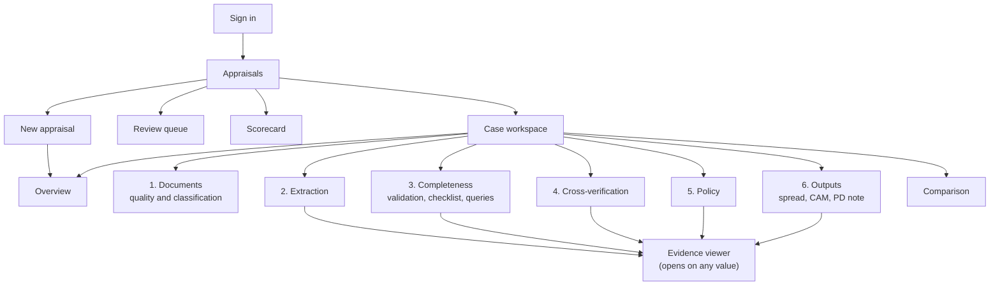

| Screen | Route | What it holds | Feature | Roles | Phone |
|---|---|---|---|---|---|
| Sign in | `/sign-in` | Sign in | F-03 | All | Yes |
| Appraisals | `/` | Every appraisal the user may see, with counts at the top; filter by stage, owner and open review items. Replaces the prototype's workbench, My Appraisals and Readiness Console | F-01 | All | Yes |
| New appraisal | `/appraisals/new` | Paste the message, confirm the proposed case, add documents; opens the new case's Overview | F-04, F-05 | RM, Analyst | Yes |
| Overview | `/appraisals/$caseId` | The stage progress, what is blocking the case, the next action, live processing, and counts of open review items, missing documents and findings | F-01, F-02, F-13.4 | All | Yes |
| 1. Documents | `/appraisals/$caseId/documents` | Upload (files, ZIP, camera). One row per document with its live status (received, graded, split, classified); quality grade, split, label mismatch, party attribution and unclassified documents shown on the row, with the type assignment there | F-05, F-07 to F-11 | All | Yes |
| 2. Extraction | `/appraisals/$caseId/extraction` | Key fields grouped as entity and parties, financials, GST and banking; each with its confidence and page; confirm or correct in place | F-15, F-16, F-17 | Analyst, Manager | No |
| 3. Completeness | `/appraisals/$caseId/completeness` | Each document's required fields and format; the checklist with each item's status and deficiency; readiness against the gates; the pre-login query list | F-12, F-13, F-14 | All | Yes |
| 4. Cross-verification | `/appraisals/$caseId/cross-verification` | Identity, turnover, bank accounts and obligations, the sources side by side with each finding | F-18, F-19 | Analyst, Manager | No |
| 5. Policy | `/appraisals/$caseId/policy` | Each norm with its limit, the actual value and source; deviations; the approving authority | F-20, F-21 | Analyst, Manager | No |
| 6. Outputs | `/appraisals/$caseId/outputs` | The spread, the draft CAM and the PD note, each a view within the tab, with citations and export | F-22, F-23, F-24 | Analyst, Manager | No |
| Comparison | `/appraisals/$caseId/comparison` | This case's outputs beside RBL's record, with adjudication | F-25 | Manager | No |
| Review queue | `/review` | Everything waiting for a person, across cases | F-17 | Analyst, Manager | No |
| Scorecard | `/scorecard` | The criteria per case and across the case set | F-26 | Manager | No |

**The case workspace.** Every tab shows:
- a persistent case header: borrower, constitution, product and amount, PAN and GSTIN, case ID, RM, open review items;
- the stage progress: the six stages in order, each marked not started, in progress, needs attention or done. A stage the user's role may not open is shown with its status but is not a link;
- a tab that has nothing to show yet says what it is waiting for (for example, documents still being classified), never an empty screen.

**Across the workspace:**
- Any value, finding or flag opens the evidence viewer in a side panel at the source page, without leaving the tab.
- A review item is resolved where it arises (the document row, the field) as well as in the review queue.
- Processing status updates without a page reload.

**Side navigation:** Appraisals, New appraisal, Review queue, Scorecard, per role. An appraisal's tabs appear only inside it.

**Earlier routes** (`/appraisals` as a list, the prototype's appraisal steps such as `/appraisals/$id/upload`, `/docready`, `/docready/$caseId/*`, `/exceptions`) redirect to their new equivalents. Screens say "appraisal"; the engine's record is the case.

**Not built:**
- Copilot rail
- Memo library
- Audit walk-through
- Admin screens
- Borrower, entity and person dossiers
- Consent journey
- Rating
- Submission
- Customer portal

## 7. Core objects and statuses

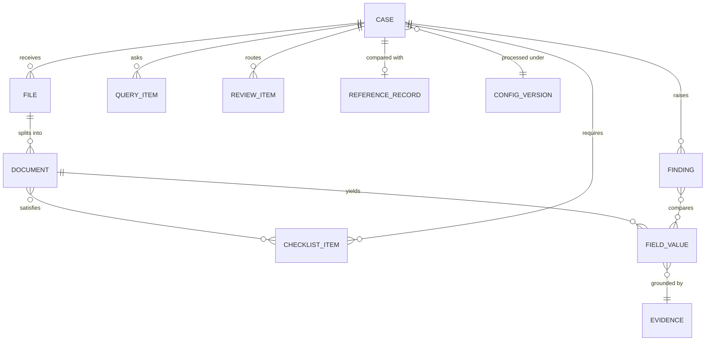

| Object | What it is | Key attributes |
|---|---|---|
| Case | One borrower's application | ID (configured format, default `BBG-YYYY-NNNNNN`); borrower header with a source per field; constitution; product and amount; branching attributes; `as_of`; stage; creator; channel; config version |
| File | Bytes as received | SHA-256; original name; path inside an archive; channel; uploader; time; label hint parsed from the name |
| Document | One logical document | File and page range; type (or types); quality grade per page; party attributed; status |
| Field value | One extracted value | Dictionary field; value; raw text; method; confidence with its components; review overlay |
| Evidence | Where a value came from | Document, page, optional region |
| Finding | A rule outcome | Rule; the compared values with evidence for each side; tolerance; outcome; severity; explanation |
| Query item | One line on the pre-login query list | Checklist item or finding; plain-language request |
| Review item | Something waiting for a person | Kind (type, field, quality, party, finding); decision; reason; who; when |
| Reference record | RBL's original assessment of the case | Classification, key fields, discrepancies, queries, deviations, decision |

**Case stages:**

The case's stage is the first of the §5 stages not yet done. The stage progress in the case workspace (§6) shows each stage's own status.

| Stage | Entered when |
|---|---|
| Intake | The case is created |
| Documents | A document is uploaded |
| Extraction | Every submitted document is classified (or assigned a type by a person) |
| Completeness | Every classified document is extracted and its key fields accepted |
| Cross-verification | The checklist's first gate is met, or credit proceeds anyway (recorded) |
| Policy | The cross-checks have run |
| Outputs | The policy norms have been evaluated |
| Completed | The spread, CAM and PD note have been generated and the comparison adjudicated |

A late document moves the case back to the earliest stage it re-opens (§5, late documents).

**Document statuses:**

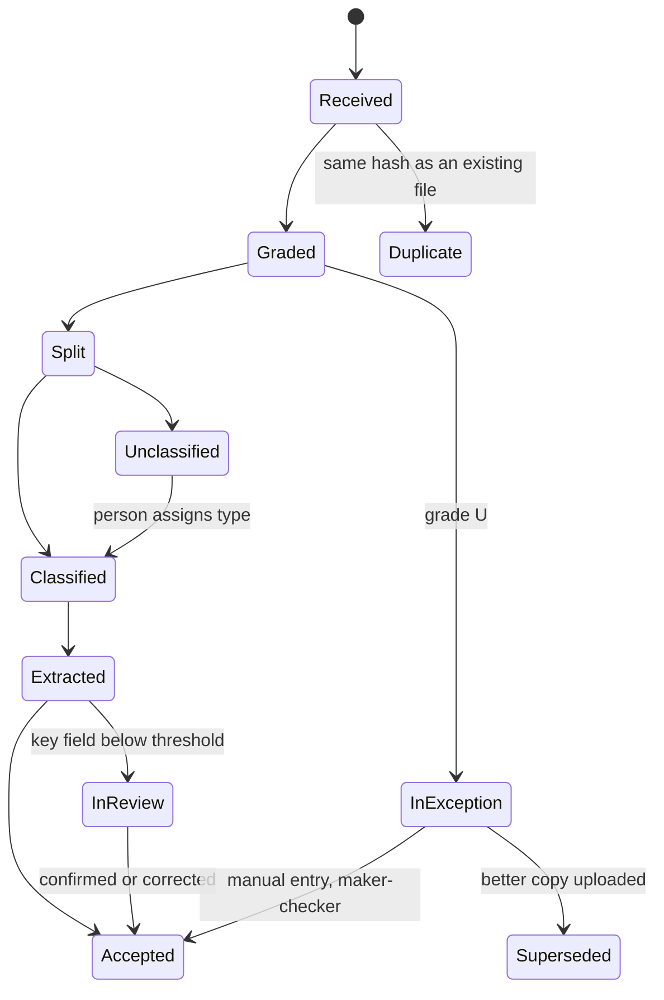

---

# Part B: Features, in build order

## Phase 0: Foundation

### F-00. Configuration catalogue

**Goal.** Hold everything that steers a decision as versioned configuration, so the scoring run uses one frozen version.

**Tests.** All, indirectly. Principle 3.

**Depends on.** Nothing. The config store (`engine/configstore/`) and checklist taxonomy already exist.

**Requirements**

- **F-00.1** Author and publish these sections. Each is validated by a schema, and each is tagged with its source (RBL-supplied, published policy, or proposed interim):

  | Section | File | Content | Used by |
  |---|---|---|---|
  | Checklist | `config/checklist_taxonomy.yaml` (exists) | Items by constitution and attributes, blocking flag, weights, gates | F-12, F-13 |
  | Document types | `config/document_types.yaml` | Closed list; for each type: required, supporting and contrary signals; the checklist items it satisfies; its instance key (period, account, person); whether it is a partner output | F-09, F-10, F-11 |
  | Field dictionaries | `config/dictionaries/<type>.yaml` | For each type: fields, value type, key-field flag, validation | F-15, F-17 |
  | Quality thresholds | `config/quality.yaml` | Resolution, blur and OCR-confidence floors; the reason codes | F-07 |
  | Document ages | `config/document_ages.yaml` | Permitted age per type (for example stock statement, bank statement, valuation) | F-13 |
  | Tolerances | `config/tolerances.yaml` | Turnover variance and matching thresholds for names and amounts | F-19 |
  | Policy norms | `config/policy.yaml` (exists, ratios only) | Eligibility, ratios, security cover, documentation, deviation categories | F-20 |
  | Approval matrix | `config/approval_matrix.yaml` | Authority by amount, product and deviation | F-21 |
  | Output templates | `config/templates/` | Spread layout, CAM sections, PD note layout | F-22 to F-24 |
  | Confidence | `config/confidence.yaml` | Weights, caps and review thresholds | F-17 |

- **F-00.2** `creditiq config validate | publish | version | diff` works for every section (it exists today for policy and checklist).
- **F-00.3** Every processing run records the published version it used.
- **F-00.4** A document-type catalogue covering at least the types in the table below, including "other known" types and `none_of_these`.

  | Group | Types |
  |---|---|
  | Origination | Application request message (the pasted email or notes), application form |
  | Constitution | Certificate of incorporation, MOA and AOA, partnership deed, proprietorship proof, board resolution or authority to borrow, partner authority letter |
  | Registration | Entity PAN, GST registration certificate, Udyam certificate |
  | KYC | Individual PAN, Aadhaar, passport, voter ID, driving licence (one instance per person) |
  | Financials | Audited financial statements (per year), provisional statements, projections, CMA data |
  | Tax | ITR acknowledgement, ITR computation (per assessment year), GSTR-3B, GSTR-1 (per period), partner GST report |
  | Banking | Bank statement (per account), partner bank-statement analysis report, sanction letter of another lender, declaration of existing facilities |
  | Working capital | Stock and book-debt statement, debtors and creditors ageing |
  | Collateral | Title document, encumbrance certificate, valuation report |
  | Bureau | Commercial bureau report, consumer bureau report (per person) |
  | Other known | Covering letter, index page, email printout |

- **F-00.5** Add checklist items the test plan needs and the current taxonomy lacks:
  - bureau report;
  - declaration of existing facilities;
  - sanction letters of existing facilities (when facilities are declared).

**Acceptance**

- Every section validates and publishes.
- Publishing unchanged configuration reuses the same version.
- Runtime code cannot import the writer (the import-linter contract passes).

**Configuration needed from RBL.** See C.3. Until each artefact arrives, the delivery team proposes an interim version, tagged `provisional`.

### F-01. Case record and workbench

**Goal.** A writable case store and a workbench listing cases.

**Tests.** Prerequisite for all.

**Depends on.** F-00.

**Requirements**

- **F-01.1** Case store in SQLite (standard library) under the data root. Case IDs are issued from a configured format and a sequence that survives restarts.
- **F-01.2** The case header keeps both values for every field: what the system proposed (with its source) and what a person confirmed or edited.
- **F-01.3** `as_of` is fixed at creation and used by every age or window rule.
- **F-01.4** The Appraisals screen lists cases with: borrower, case ID, product and amount, stage, RM, created date, and open review items. The RM sees their own cases; credit roles see all.
- **F-01.5** A case can be reset to unprocessed, which clears derived outputs and keeps files and the audit record. A case can be purged, which deletes all its data and keeps a purge record.

**Acceptance**
- A case created through the API appears on the workbench.
- The ID is unique under concurrent creation.
- Reset and purge behave as stated.

### F-02. Document register and processing jobs

**Goal.** Every file and document has a status, a lineage and stage timings. Processing runs as resumable jobs.

**Tests.** TC-03, TC-31 (C9).

**Depends on.** F-01.

**Requirements**

- **F-02.1** The register records files and logical documents with lineage: file, then page range, then document. It also records supersession (`version_of`) and duplicate relations.
- **F-02.2** Document statuses follow the state diagram in section 7. Status changes are visible on the Documents screen without a page reload.
- **F-02.3** A job queue in SQLite is shared by the API and the command line. A killed job resumes, and nothing is processed twice. Re-submitting unchanged files processes nothing new.
- **F-02.4** Each stage records its start and end time per document and per case. Timings are exportable (C9).
- **F-02.5** An append-only decision log records case creation, uploads, review decisions, configuration version per run, resets and purges.

**Acceptance**
- A killed job resumes.
- Re-submission is idempotent.
- Per-stage timings appear for a processed case.

### F-03. Sign-in and roles

**Goal.** Named users with server-enforced roles.

**Tests.** Prerequisite for all.

**Depends on.** Nothing. Sign-in exists today with one shared password.

**Requirements**

- **F-03.1** Every data endpoint requires a valid session. It returns 401 without one, and 403 for the wrong role.
- **F-03.2** Roles and navigation come from `config/roles.yaml` (section 4).
- **F-03.3** Sessions persist across a server restart and expire after a configured idle time.
- **F-03.4** A maker-checker checker must differ from the maker. The server enforces this.

**Acceptance**
- A role-by-endpoint test matrix passes.

---

## Phase 1: Case creation and intake

### F-04. New application from a pasted message

**Goal.** The RM pastes a sourcing email or notes. CreditIQ proposes the case, and the RM confirms before it exists.

**Tests.** TC-01 (C3). Mobile: TC-02.

**Depends on.** F-01, F-03.

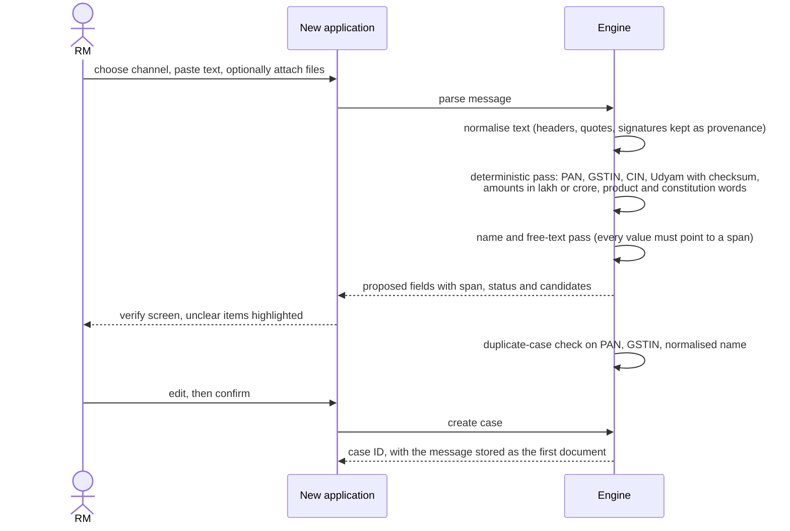

**Screen mock: verify and create**

```text
┌ New application ───────────────────────────────────────────────────────────────┐
│ Channel [Email ▾]                                                              │
│ ┌ Message ─────────────────────────┐ ┌ Proposed case ────────────────────────┐ │
│ │ From: ...  Subject: CC renewal   │ │ Borrower      [<Borrower> Pvt Ltd]  ✓ │ │
│ │ ...client wants CC of ▓50L▓      │ │ Constitution  [Pvt Ltd | LLP ?]     ⚠ │ │
│ │ and a TL, PAN ▓AAACX1234X▓ ...   │ │ Product       [Cash credit]         ✓ │ │
│ │ turnover approx ▓3 cr▓ ...       │ │ Amount        [50,00,000]           ✓ │ │
│ │                                  │ │ PAN           [AAACX1234X]          ✓ │ │
│ │ (clicking a field highlights     │ │ GSTIN         —             not found │ │
│ │  its source span here)           │ │ Declared T/O  [3,00,00,000]         ✓ │ │
│ └──────────────────────────────────┘ │ ⚠ 2 items need your confirmation      │ │
│                                      └───────────────────────────────────────┘ │
│                                                                                │
│ ⚠ A case with this PAN exists: BBG-2026-000014    [Open it] [Create anyway]    │
│                                                                                │
│                                            [Discard]  [Create application]     │
└────────────────────────────────────────────────────────────────────────────────┘
```

**Requirements**

- **F-04.1** The channel options come from configuration: email, WhatsApp, phone note, walk-in, other. The pasted original is stored unchanged, with its hash.
- **F-04.2** Fields extracted:
  - borrower name
  - constitution
  - product
  - amount requested
  - PAN, GSTIN, CIN or Udyam
  - promoter names
  - declared turnover
  - existing banking
  - contact
- **F-04.3** Each field shows a status:
  - **found**, with its source span;
  - **unclear**, with its candidates (for example "3 cr or 30 cr?", or two company names);
  - **not found**.

  A value with no span in the message is not proposed.
- **F-04.4** Identifiers that fail their checksum or format are flagged as invalid and never corrected.
- **F-04.5** Duplicate check: if an existing case matches on PAN, GSTIN or normalised name, the RM is offered **Open it** or **Create anyway**. Create anyway requires a reason.
- **F-04.6** The minimum fields to create a case come from configuration. The default is borrower name, product and amount.
- **F-04.7** **No case exists until the RM confirms.** Discarding leaves nothing behind.
- **F-04.8** On creation:
  - the checklist is derived (F-12);
  - the message becomes the case's first document;
  - declared figures (turnover, loan ask, existing facilities) are stored as the source "RM declaration, unverified" for F-19;
  - edits keep both the proposed and the confirmed value.
- **F-04.9** Extraction here is rule-based first. A model may be used for names and free text, under principle 6.

**Acceptance (TC-01)**
- For each case's sourcing email or notes, every extracted field is either correct or highlighted as unclear.
- No case is created without confirmation.

### F-05. Document upload: single, multiple and ZIP

**Goal.** Accept every file the RM has, register each one, and lose nothing silently.

**Tests.** TC-03 (C1). Mobile: TC-02.

**Depends on.** F-02.

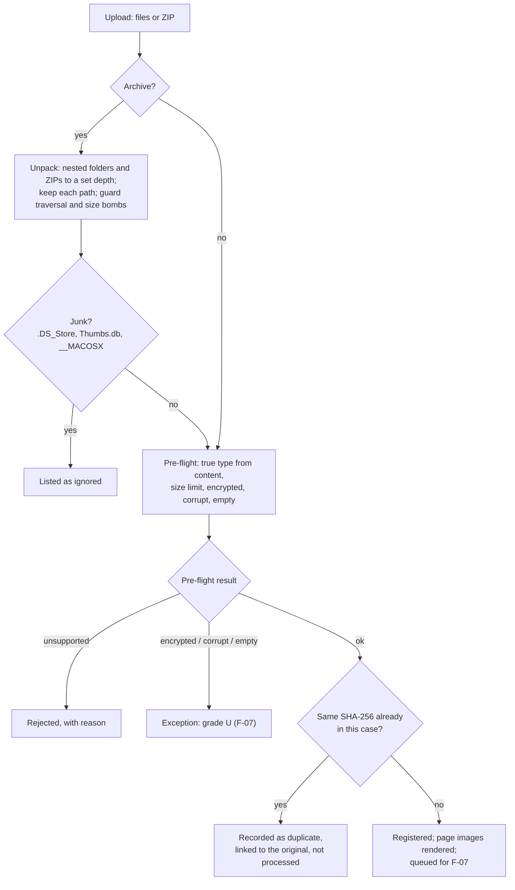

**Screen mock: Documents tab**

```text
┌ BBG-2026-000021 · <Borrower> Pvt Ltd · Pvt Ltd · CC 50L ─────────────────────────────┐
│ Documents | Checklist | Extracted data | Cross-checks | Policy | Outputs             │
├──────────────────────────────────────────────────────────────────────────────────────┤
│ [ Drop files or a ZIP here · or browse ]                                             │
│                                                                                      │
│ case-file.zip (23 files)                                           Status      Grade │
│  ├ KYC/director1_pan.jpg   PAN (individual) · Director 1            Accepted    A    │
│  ├ bank stmt apr-mar.pdf   ⚠ Balance sheet FY25 (label: bank stmt)  Extracted   A    │
│  ├ merged_docs.pdf  p1-2   GST registration                         Classified  A    │
│  │                  p3-9   Bank statement ·1234                     Extracted   B    │
│  │                  p10    ? Unclassified → Review queue            In review   B    │
│  ├ photo_0412.jpg          ITR acknowledgement                      Re-scan ⚠   C    │
│  ├ bank stmt apr-mar.pdf   Duplicate of item 2                      Duplicate   —    │
│  └ Thumbs.db               Ignored (system file)                    Ignored     —    │
│ Rejected: statement.numbers (unsupported format)                                     │
└──────────────────────────────────────────────────────────────────────────────────────┘
```

**Requirements**

- **F-05.1** Accept single files, multiple files and ZIP archives.
  - Formats: PDF, JPG, PNG, TIFF, XLSX and CSV, DOCX.
  - Size limits come from configuration. The defaults are 50 MB per file and 500 MB per archive.
- **F-05.2** Unpack nested folders and ZIPs to a configured depth, keeping each file's path inside the archive.
  - Refuse path traversal and decompression bombs, with a reason.
  - List junk files as ignored.
- **F-05.3** Detect the true type from content, not the extension.
  - Unsupported files are rejected with a reason.
  - Password-protected, corrupt or empty files become exceptions (grade U).
- **F-05.4** Exact duplicates (same SHA-256 within the upload or already in the case) are recorded as duplicates, linked to the original and not processed. Near-duplicates are detected in F-08.
- **F-05.5** Every file shows its status on the Documents screen, and archives show as a tree. **Every file ends in a visible state: registered, duplicate, ignored, rejected or exception.**
- **F-05.6** Page images are rendered with pypdfium2, in the coordinate space the evidence viewer uses.
- **F-05.7** Files can be added to an existing case at any time. Only new files are processed. A better copy of an exception document supersedes it.
- **F-05.8** Stored file names are generated. The original name is kept as metadata.

**Acceptance (TC-03)**
- A full case uploaded as a ZIP, and again as multiple files including a duplicate, registers every file and identifies the duplicate.

### F-06. Mobile RM screens

**Goal.** An RM on a phone can do what they do on a desktop.

**Tests.** TC-02.

**Depends on.** F-04, F-05, F-14. Built alongside each.

**Requirements**

- **F-06.1** At phone width (375 px), these screens work without horizontal scrolling:
  - Sign in
  - Appraisals
  - New appraisal
  - Overview
  - Documents, including upload from the camera or files
  - Completeness, including the query list
- **F-06.2** Navigation is a menu button at phone width. The side navigation is hidden.
- **F-06.3** Other screens are desktop-first and must not break on a phone.

**Acceptance (TC-02)**
- A Playwright run at 375 px creates a case and uploads documents with the same result as on a desktop.

---

## Phase 2: Document intelligence (priority 1)

F-07 to F-09, F-11 and F-15 are implemented in the vendored ingest engine sidecar (`services/ingest-engine`, decision AD-2). It returns results in the contract shape `contracts/ingest-result.schema.json` (AD-4). The CreditIQ engine owns everything case-level: the register, checklist mapping, party attribution, review and cross-checks.

### F-07. Page reading and quality grade

**Goal.** Read every page and grade it, so that unusable documents are flagged with a reason and a re-scan request.

**Tests.** TC-05 (C1).

**Depends on.** F-05.

**Requirements**

- **F-07.1** Each page is read by the route that suits it:
  - the text layer, when it is trustworthy (spot-checked against the rendered page);
  - OCR for scans and photos;
  - spreadsheets read cell by cell.

  The result is a word index with positions for each page.
- **F-07.2** Each page gets a grade, using thresholds from `config/quality.yaml`:

  | Grade | Meaning | Effect |
  |---|---|---|
  | A | Clean | Normal |
  | B | Degraded (low resolution, skew, blur, noise) | Processed; confidence caps apply |
  | C | Poor: OCR confidence below the floor on pages carrying fields | Processed; every key field goes to review; re-scan recommended |
  | U | Unreadable: corrupt, encrypted, blank, nothing legible | Exception: re-scan or maker-checker manual entry |

- **F-07.3** The document grade is the worst grade among its non-blank pages. Page grades are kept, so one bad page raises a page-level exception, not a document rejection.
- **F-07.4** Grades C and U carry a reason code: resolution, blur, skew, shadow, OCR floor, corrupt, encrypted, blank or missing page. They also produce a plain-language re-scan request that goes onto the query list (F-14).
- **F-07.5** Grade U is resolved in one of three ways:
  - **Better copy:** the new document supersedes the old one and only that document re-runs.
  - **Manual entry, maker-checker:** the entry form is generated from the type's dictionary. Values are marked as manual everywhere, and are excluded from C3.
  - **Waive:** only for a non-mandatory item, with a reason.
- **F-07.6** Classification is still attempted on grades C and U (F-09).

**Acceptance (TC-05)**
- The flags on blurred, skewed, shadowed and low-resolution scans agree with the RBL reviewer's view of legibility.

### F-08. Splitting merged documents

**Goal.** A PDF holding several documents becomes several documents, each with its page range.

**Tests.** TC-04 (C1).

**Depends on.** F-07.

**Requirements**

- **F-08.1** Boundaries are detected from page content: headers, a change of document type, page numbering restarting, and a change of issuer or party. The model is used only where boundaries are uncertain.
- **F-08.2** Each logical document keeps its source file and page range, and is classified separately.
- **F-08.3** Repeating instances are separate documents with an instance key: twelve GSTR-3Bs, two ITR years, two directors' KYC, one statement per account.
- **F-08.4** Several images that are pages of one document are grouped. If the grouping is uncertain, it is flagged for review.
- **F-08.5** Near-duplicates are recorded as duplicates: the same content at a different file hash, or a document already contained in another. The executed copy is preferred to a draft.
- **F-08.6** An uncertain split point goes to the review queue.

**Acceptance (TC-04)**
- For each merged PDF, the split points and the classification of each part are correct.

### F-09. Classification by content, and the unclassified route

**Goal.** Identify every document's type from its content, map it to the checklist, and route anything unrecognised to a person.

**Tests.** TC-06 and TC-09 (C1).

**Depends on.** F-00 (document types), F-07, F-08.

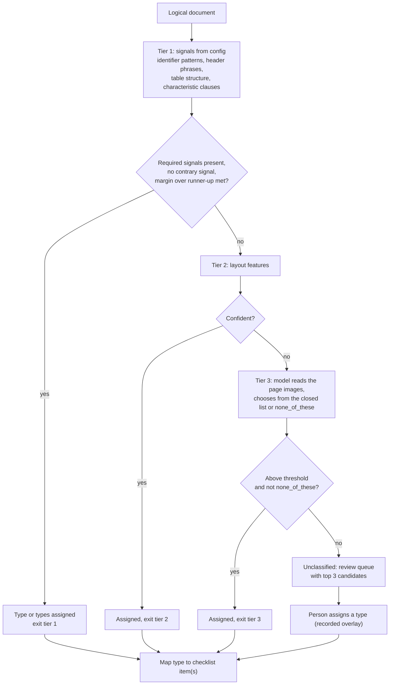

**Requirements**

- **F-09.1** Classification chooses only from the closed list in `config/document_types.yaml`, or `none_of_these`. **The file name is never an input** (it is used only by F-10).
- **F-09.2** One document may have several types when it satisfies several requirements. An example is a combined ITR acknowledgement and computation.
- **F-09.3** An exit at tier 1 needs three things: the type's required signals, no contrary signal, and a configured margin over the second candidate. This guards against false positives such as a bank narration reading "GST PAYMENT" or a covering letter that lists every document.
- **F-09.4** Every classification records:
  - the signals found;
  - the exit tier;
  - the confidence;
  - the top three candidates.

  These are shown on the document's detail panel.
- **F-09.5** Unclassified documents go to the review queue with their top three candidates, and **are never assigned to a checklist item** until a person assigns a type. The assignment is a recorded overlay, and extraction then proceeds.
- **F-09.6** Mapping a type to checklist items is a separate, case-aware step. Which items a type satisfies can depend on constitution and product.

**Acceptance**
- **TC-06:** each document in each case is identified by type and mapped to its checklist item, irrespective of file name. Target C1 of at least 90%. Documents routed for human confirmation are reported separately.
- **TC-09:** a document outside the checklist is routed for review with suggested types, and is not assigned incorrectly.

### F-10. Label mismatch and party attribution

**Goal.** Report file names that contradict the content, and attribute personal documents to the right person.

**Tests.** TC-07 and TC-08 (C1).

**Depends on.** F-09, and the identity fields extracted in F-15 (KYC names, PAN, DIN, date of birth).

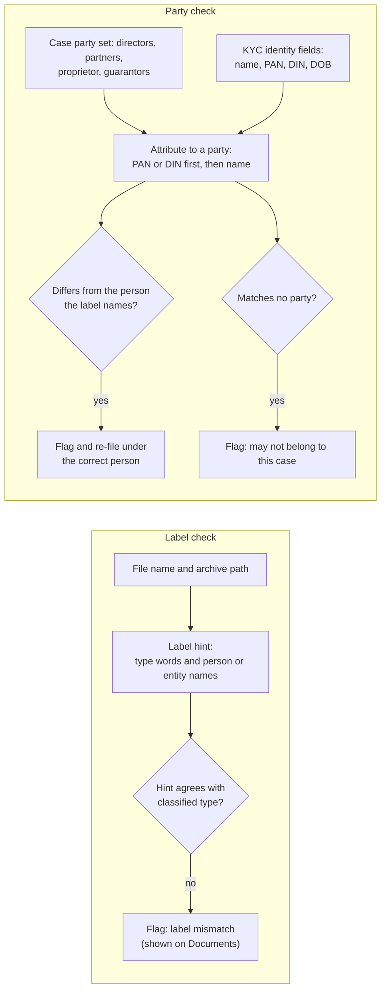

**Requirements**

- **F-10.1** A label hint is parsed from the file name and archive path (type words, person and entity names). The hint is stored, never used to classify, and compared with the classified type. A mismatch is reported on the Documents screen.
- **F-10.2** The case party set is built from:
  - constitution documents;
  - the application or message;
  - the bureau report;
  - person input.

  Each party carries a source.
- **F-10.3** KYC and other personal documents are attributed to a party by PAN or DIN first, then by normalised name.
  - If the label names a different party, the document is re-filed and the mismatch is flagged.
  - A document matching no party is flagged as possibly not belonging to the case.
- **F-10.4** KYC completeness: the parties that need KYC are compared with the KYC received. Gaps go to the checklist (F-13).
- **F-10.5** A person can confirm or override every attribution, with a reason.

**Acceptance**
- **TC-07:** a balance sheet named as a bank statement is classified correctly and the mismatch is reported.
- **TC-08:** one director's KYC filed under another director's name is attributed to the right person and flagged.

### F-11. Partner outputs as sources

**Goal.** Treat the GST, bank-statement analysis and bureau reports from RBL's partners as first-class sources.

**Tests.** TC-10 (C1, C3).

**Depends on.** F-09, F-15.

**Requirements**

- **F-11.1** The partner GST report, partner bank-statement analysis report and bureau reports are document types with their own signals and dictionaries. They are recognised in whatever format RBL supplies: PDF or spreadsheet.
- **F-11.2** A partner report satisfies the same checklist item as the underlying documents: the GST report satisfies GST returns, and the analysis report satisfies bank statements. Where both are present, both are sources for F-19.
- **F-11.3** Fields extracted:

  | Report | Fields |
  |---|---|
  | GST report | Turnover by period, filing dates, periods missing |
  | Analysis report | Credits, debits and balances by account and month; EMIs; cheque returns; cash deposits |
  | Bureau | Score, facilities with lender, amount and EMI, overdue status, key observations |

**Acceptance (TC-10)**
- Each partner output is recognised and its key fields extracted, measured under C3.

---

## Phase 3: Completeness

### F-12. Checklist by constitution and product

**Goal.** Apply the correct RBL checklist to every case.

**Tests.** TC-15 (C2).

**Depends on.** F-00, F-01. The deriver exists in `engine/checklist.py`.

**Requirements**

- **F-12.1** The checklist is derived from constitution, product and attributes: collateral present, term loan requested, cash credit requested, MPBF applicable, existing facilities declared.
- **F-12.2** Attributes are derived from the case header, not typed in by hand. MPBF applicability comes from the amount and a configured method rule.
- **F-12.3** While constitution or product is unknown, the checklist is marked provisional. It is re-derived whenever either is confirmed or changed.
- **F-12.4** Each item shows why it is required and its basis, both from configuration.

**Acceptance (TC-15)**
- The correct checklist is applied in every case of the set, across the constitutions and facility types present.

### F-13. Document sufficiency: satisfied, insufficient, missing

**Goal.** Mark every checklist item with its status and the specific deficiency.

**Tests.** TC-11, TC-12, TC-13 and TC-14 (C2).

**Depends on.** F-09, F-10, F-12. Some checks need extracted fields from F-15.

**Screen mock: Completeness tab, checklist**

```text
┌ Checklist · Pvt Ltd · CC + TL · collateral ── Readiness 72% · Gate 85% ────────────────┐
│ Constitution and KYC                                                                   │
│  ✓ Certificate of incorporation   Satisfied                                 → doc 3 p1 │
│  ⚠ Board resolution               Insufficient: unsigned                    → doc 7 p2 │
│  ✗ KYC of directors               Missing: 1 of 3 (Director 2)                         │
│ Financials                                                                             │
│  ✓ Audited FS FY24, FY25          Satisfied                                            │
│  ⚠ Provisional FS FY26            Insufficient: balance sheet pages absent             │
│ Banking and operations                                                                 │
│  ⚠ GST returns (12 months)        Insufficient: Apr–Jul 2025 absent                    │
│  ⚠ Stock statement                Outdated: dated 31 Jan 2026, max 60 days             │
│  ⚠ Bank statements                Insufficient: 1 of 2 declared accounts               │
│ Collateral                                                                             │
│  ✗ Valuation report               Missing                                              │
│                                                                                        │
│                                                       [Pre-login query list (7) ▸]     │
└────────────────────────────────────────────────────────────────────────────────────────┘
```

**Requirements**

- **F-13.1** Each item has one of these statuses:

  | Status | When |
  |---|---|
  | Satisfied | Present and valid |
  | Insufficient | Present, but incomplete, outdated, unsigned or unstamped. The deficiency is stated |
  | Missing | Absent. The specific document needed is stated |
  | In review | Waiting for a type assignment or quality resolution |
  | Waived | Non-mandatory only, with a reason |

- **F-13.2** Checks for document defects:
  - **Pages absent:** broken pagination, or a statement section missing (for example provisional financials without balance-sheet pages).
  - **Period gaps:** GST months, bank statement months, or ITR years missing against the required coverage.
  - **Unsigned or unstamped,** where the type requires a signature or stamp.
  - **Outdated:** the document date is older than the permitted age in `config/document_ages.yaml`, measured from the case's `as_of`. The message states the date and the permitted age.
  - **KYC incomplete** against the party set (F-10.4).
- **F-13.3** Document defects make the item insufficient. **They do not lower extraction confidence:** a correct reading of a defective document is still a correct reading.
- **F-13.4** Readiness is the weighted proportion satisfied, using section and item weights. It is compared with the configured gates. A missing or insufficient blocking item prevents the first gate, whatever the proportion.
- **F-13.5** When every item is satisfied, the case is marked **ready for credit**.

**Acceptance**
- **TC-11:** a complete file shows all items satisfied and is marked ready for credit, as confirmed by the reviewer.
- **TC-12:** every missing item is identified, with a specific request.
- **TC-13:** each incomplete document is identified with its specific deficiency.
- **TC-14:** each outdated document is identified, with its date and the permitted age.

### F-14. Consolidated pre-login query list

**Goal.** One list of everything needed from the customer, in plain language for the RM, so they ask in one go.

**Tests.** TC-16 (C6). Also TC-12.

**Depends on.** F-07, F-13. Also takes findings from F-19 as clarifications.

**Screen mock: the query list**

```text
┌ Pre-login query list · BBG-2026-000021 ── [Copy as email] [Copy] ────────────┐
│ Documents needed                                                             │
│  1. KYC of Director 2: PAN and address proof.                                │
│  2. Valuation report for the property offered as collateral.                 │
│  3. GST returns (GSTR-3B) for April to July 2025.                            │
│ Documents to redo                                                            │
│  4. Board resolution: the copy provided is not signed.                       │
│  5. Stock statement dated within the last 60 days (latest is 31 Jan 2026).   │
│  6. ITR acknowledgement FY25: the photo is blurred; please re-scan.          │
│ Clarifications                                                               │
│  7. Bank statements show a monthly EMI of ₹1,45,000 to a lender not in       │
│     the declaration of existing facilities. Please explain.       → evidence │
└──────────────────────────────────────────────────────────────────────────────┘
```

**Requirements**

- **F-14.1** The list is generated from:
  - missing and insufficient checklist items;
  - quality exceptions and re-scan requests;
  - unresolved label and party flags;
  - cross-check findings that need the customer's explanation.
- **F-14.2** The list is grouped into three sections: documents needed, documents to redo, and clarifications. Each item uses plain language from a configured phrasing, and links to its evidence.
- **F-14.3** The list can be copied as email or plain text. Nothing is sent from the system.
- **F-14.4** The list refreshes as items are resolved. Resolved items are shown as resolved, not deleted.

**Acceptance (TC-16)**
- For any case with gaps, a single list is produced. C6: at least 80% of the document and data queries RBL credit raised on the case appear in it.

---

## Phase 4: Extraction with evidence (priority 2)

### F-15. Field extraction per document type

**Goal.** Extract the key fields of every document into its type's dictionary, each grounded to a page.

**Tests.** TC-17, TC-18 (extraction), TC-19, TC-20 (C3).

**Depends on.** F-00 (dictionaries), F-09.

**Requirements**

- **F-15.1** Extraction runs per document instance, against that type's dictionary. Every field returns one of:
  - a value, with the raw text as printed, the page (and region where available), the method, and confidence components;
  - **missing**, with a reason.
- **F-15.2** Deterministic methods run first; the model fills only what remains:
  - identifiers by pattern, validated by checksum or format;
  - labels anchored to values on the same row;
  - table cells by row and column;
  - known positions.
- **F-15.3** Tables:
  - **Bank statements:** rows and columns are reconstructed from word positions. The running balance is the check: single-cell errors are repaired arithmetically before any model call, and every repair is recorded.
  - **Financial statements:** the model maps row labels and columns to the dictionary, and never emits numbers itself. Numbers come from the page.
- **F-15.4** Every value is checked against the page's word index. **A value that cannot be found on its page is rejected** and shown as missing.
- **F-15.5** Identifiers are attributed to the right party: the borrower's GSTIN, not a customer's GSTIN printed on the same invoice.
- **F-15.6** Key fields are the section 5.3 list, to be finalised with RBL:

  | Area | Key fields | Sources |
  |---|---|---|
  | Identity | Legal name, constitution, PAN, GSTIN, CIN or Udyam, promoters / directors / partners | Constitution, registration and KYC documents; ITR; bureau |
  | Request | Facility type, amount requested | Message, application |
  | Financials | Turnover per audited statements (each year); EBITDA, PAT, net worth, total borrowings, current assets, current liabilities | Audited and provisional statements |
  | GST | Turnover by period, filing dates, periods missing | GSTR-3B, GSTR-1, partner GST report |
  | Banking | Credits, debits, balances by account and month; EMIs; cheque returns; cash deposits; the bank accounts held | Bank statements, analysis report |
  | Obligations | Existing monthly obligations; facilities with lender and amount | Declaration, sanction letters, bureau, bank statements |
  | Bureau | Score, key observations | Bureau reports |

- **F-15.7** Accuracy is measured separately for digital documents and for scanned or photographed documents.

**Acceptance**
- **TC-17:** identifiers, names, dates and the promoter set are extracted with evidence.
- **TC-18:** P&L and balance-sheet items are extracted for each year.
- **TC-19:** GST turnover by period and filing dates are extracted, and missing periods identified.
- **TC-20:** credits, debits, balances, EMIs, returns and cash deposits are extracted by account and month.
- C3 targets: at least 90% on digital documents and at least 80% on scanned documents.

### F-16. Evidence viewer

**Goal.** Any value, figure or flag opens its source page in one click.

**Tests.** TC-21 (C7). Used by TC-22 to TC-29.

**Depends on.** F-05.6 (page images), F-15.

**Screen mock: Extraction tab, with evidence**

```text
┌ Extracted data · Banking ────────────────────────┐ ┌ Evidence ────────────────────┐
│ Account ·1234 (Bank 1)  Apr 25 – Mar 26          │ │ bank_stmt.pdf · page 7 of 42 │
│ Month   Credits     Debits      EMIs      Conf   │ │ ┌──────────────────────────┐ │
│ Apr 25  42,10,500   39,80,200   1,45,000  0.97   │ │ │ 05/04 NACH LENDER X      │ │
│ May 25  38,95,000   37,10,450   1,45,000  0.97   │ │ │ ▓1,45,000.00▓      ...   │ │
│ Jun 25 ▸41,02,300   40,55,000   1,45,000  0.62 ⚠ │ │ │                          │ │
│ ...                                              │ │ └──────────────────────────┘ │
│ Cheque returns: 2 (Aug, Nov) · Cash deposits 18% │ │ [◂ prev]  page 7  [next ▸]   │
└──────────────────────────────────────────────────┘ └──────────────────────────────┘
```

**Requirements**

- **F-16.1** Clicking any extracted value, derived figure, finding side, checklist evidence, CAM citation or PD-note link opens the viewer at the source page. The region is highlighted where known.
- **F-16.2** The viewer can show two sources side by side, which finding reviews use (F-19).
- **F-16.3** The viewer shows the document type, file name, page number, grade, and the value's confidence and method.

**Acceptance (TC-21, C7)**
- At least 90% of figures, extracted fields and flags link to the correct document and page.
- An automated click test samples values on every screen.

### F-17. Confidence and the review queue

**Goal.** Every field carries a confidence score. Low-confidence key fields, and everything else needing a person, land in one review queue.

**Tests.** TC-21 (C7). Supports TC-05, TC-08 and TC-09. Reported indicator: review effort.

**Depends on.** F-15.

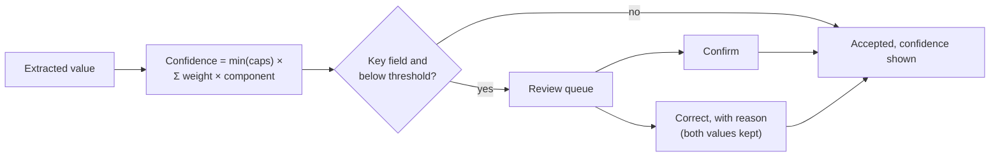

**Screen mock: Review queue**

```text
┌ Review queue (14) ── Filter: [All kinds ▾] [All cases ▾] [Mine ▾] ────────────┐
│ Kind          Case      Item                                              Age │
│ Type          BBG-…021  merged_docs.pdf p10 (utility bill? 0.41)          2h  │
│ Field         BBG-…021  GSTR-3B Jun: outward supplies (0.58)              1h  │
│ Quality       BBG-…019  photo_0412.jpg grade C: blur                      3h  │
│ Party         BBG-…021  KYC labelled Director 1, PAN matches Director 2   1h  │
│ Manual entry  BBG-…017  ITR FY24 by maker, awaiting checker               5h  │
└───────────────────────────────────────────────────────────────────────────────┘
```

**Requirements**

- **F-17.1** Confidence is computed per field as `min(caps) × Σ weightᵢ × componentᵢ`.
  - Components: classification, page grade, text-layer or OCR trust, validation outcome, and agreement between two reads.
  - Caps, for example: checksum fail 0.30; value not found on a trusted page 0.40.
  - Weights, caps and thresholds come from `config/confidence.yaml`.
  - A model's self-reported confidence is never a numeric input.
- **F-17.2** A key field below its threshold goes to review **before** triangulation uses it. Other fields are accepted with their confidence shown.
- **F-17.3** Document and case confidence are roll-ups shown with their composition. They are not presented as a credit score.
- **F-17.4** The review queue holds these kinds of item:
  - type assignment (F-09);
  - field review (this feature);
  - quality exception (F-07);
  - party or label flag (F-10);
  - uncertain split (F-08);
  - manual entry awaiting a checker (F-07.5).
- **F-17.5** Decisions are confirm, correct or waive, with a reason for correct and waive. The system's value and the human decision are both kept and both shown. Decisions never change configuration.
- **F-17.6** The review count per case is reported (review effort indicator).

**Acceptance (TC-21)**
- Every field carries a confidence score and a page link.
- Low-confidence key fields are routed for review.
- A correction is used downstream, and both values are shown.

---

## Phase 5: Triangulation (priority 3)

### F-18. Fact alignment

**Goal.** Turn extracted fields into comparable facts before cross-checking.

**Tests.** Prerequisite for TC-22 to TC-25.

**Depends on.** F-15, F-17.

**Requirements**

- **F-18.1** **Period alignment.** Annual, monthly and transaction figures are brought to the same window (financial year, GST period, statement month). Coverage gaps are recorded.
- **F-18.2** **Bank-credit cleansing.** Inter-account transfers, loan disbursals, reversals and returned cheques are removed from credits, using configured rules, before the remainder is treated as business inflow. Every exclusion is recorded with its transactions.
- **F-18.3** **Entity resolution.** Variant names for the same person, firm or lender resolve to one entity, with the variants kept.
- **F-18.4** **Obligation inference.** Recurring debits to lenders (NACH, ECS, EMI narrations; regular amounts) are identified, each with its evidence transactions.
- **F-18.5** **Account set.** The accounts evidenced across all documents are collected: statements, sanction letters, bureau, transfers between accounts, financial-statement notes.
- **F-18.6** Every aligned fact keeps links to the field values it came from, so evidence survives to the finding.

**Acceptance**
- For each case, aligned turnover by period, cleansed credits, inferred obligations and the account set are inspectable, each with its evidence.

### F-19. Cross-checks: identity, turnover, bank accounts, obligations

**Goal.** Surface the discrepancies credit would otherwise find later, each with its evidence on both sides.

**Tests.** TC-22, TC-23, TC-24 and TC-25 (C4, C5).

**Depends on.** F-18. Tolerances from F-00.

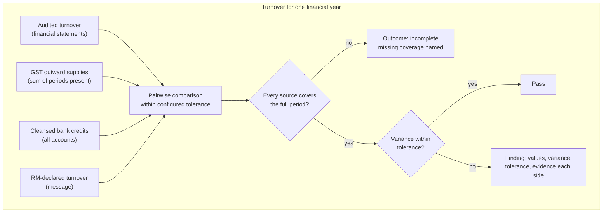

**Screen mock: Cross-verification tab**

```text
┌ Cross-checks · 11 rules · 3 findings · 1 incomplete ──────────────────────┐
│ ● Serious     Undeclared lender EMI                                 OB-02 │
│      ₹1,45,000/month to Lender X in bank stmt ·1234 (12 debits)    → p7 … │
│      Declaration of existing facilities: nil for Lender X           → p1  │
│ ● Moderate    Turnover: GST vs bank credits FY25                    TO-02 │
│      GST ₹4.82 cr (→ GSTR-3B ×12)   Bank ₹3.91 cr (→ stmt ·1234)          │
│      Variance 18.9% · tolerance 15%                                       │
│ ◐ Incomplete  Turnover: audited vs GST FY25                         TO-01 │
│      GST covers 8 of 12 months (Apr–Jul absent)                           │
│ ✓ Pass        PAN consistent across 6 documents                     ID-01 │
│ [Show passes (8)]                                                         │
└───────────────────────────────────────────────────────────────────────────┘
```

**Requirements**

- **F-19.1** Each rule is configuration: a variable, the sources it compares, the comparison type, a tolerance key, a severity, whether it blocks, and a plain-language explanation template. Comparison types are exact, within tolerance, set equality, set containment, and presence.
- **F-19.2** Minimum rule set:

  | ID | Check | Sources | Comparison | Test |
  |---|---|---|---|---|
  | ID-01 | Entity PAN | PAN document, GST registration, ITR, financials, bureau | Exact | TC-22 |
  | ID-02 | GSTIN | Registration, returns, partner GST report | Exact | TC-22 |
  | ID-03 | Legal name | All identity-bearing documents | Normalised match | TC-22 |
  | ID-04 | Promoter set | Constitution documents, KYC received, application, bureau | Set equality | TC-22 |
  | TO-01 | Audited turnover vs GST outward supplies, same year | Financials, GST | Within tolerance | TC-23 |
  | TO-02 | GST vs cleansed bank credits, same period | GST, bank | Within tolerance | TC-23 |
  | TO-03 | Audited turnover vs cleansed bank credits | Financials, bank | Within tolerance | TC-23 |
  | TO-04 | RM-declared vs evidenced turnover | Message, financials | Within tolerance | TC-23 |
  | BA-01 | Declared accounts have statements | Application or declaration, statements | Containment | TC-24 |
  | BA-02 | Accounts evidenced elsewhere are declared | Account set (F-18.5), declaration | Containment | TC-24 |
  | OB-01 | Declared facilities reconcile with sanction letters and bureau | Declaration, sanction letters, bureau | Set equality | TC-25 |
  | OB-02 | EMIs in bank statements go to declared lenders | Inferred obligations, declaration | Containment | TC-25 |

- **F-19.3** Every rule outcome is one of pass, fail, incomplete (with the missing coverage named) or not applicable. A failure records both sides' values, each with evidence, plus the tolerance and the explanation.
- **F-19.4** A finding that relies on a manually entered or corrected value says so.
- **F-19.5** Findings needing the customer's explanation feed the query list (F-14). Blocking findings are shown on the checklist.
- **F-19.6** Changing one tolerance and re-running changes exactly the findings that depend on it.

**Acceptance**
- **TC-22:** mismatches in PAN, GSTIN, names or the promoter set are flagged with their sources.
- **TC-23:** turnover is compared across sources; variances beyond tolerance are flagged with their values; incomplete coverage is stated.
- **TC-24:** accounts without statements, and undeclared accounts, are identified.
- **TC-25:** obligations are reconciled, and EMIs to undeclared lenders are identified.
- C4: at least 85% of evidenced discrepancies in RBL's record are found. C5: at least 85% of the solution's flags are accepted as valid.

---

## Phase 6: Policy

### F-20. Policy norms and deviations

**Goal.** Evaluate RBL's key BBG norms from the documents, and list deviations.

**Tests.** TC-26 (C4, C5).

**Depends on.** F-18. Financial ratios need the normalised financials used by F-22.

**Requirements**

- **F-20.1** Each norm in `config/policy.yaml` has a formula over facts, a threshold, the deviation category it falls under, and its source. Norm families: eligibility, ratios, security cover, documentation.
- **F-20.2** For each case, every applicable norm is shown with:
  - the norm;
  - the required value;
  - the actual value;
  - the source figures (each with evidence);
  - pass or deviation;
  - the deviation category.
- **F-20.3** A norm whose inputs are missing shows as "cannot evaluate", naming the missing input. It is never shown as a pass.
- **F-20.4** The deviation list feeds the CAM summary (F-23).

**Acceptance (TC-26)**
- Norms are assessed and deviations listed with norm, actual value and source. The list agrees with RBL's deviation record.

### F-21. Approving authority

**Goal.** Identify the authority the case requires and compare it with the recorded approval.

**Tests.** TC-27 (C4). **Built only if RBL provides its approval matrix.**

**Depends on.** F-20, F-25 (for the recorded approval).

**Requirements**

- **F-21.1** The required authority is looked up from `config/approval_matrix.yaml` by amount, product and deviation categories.
- **F-21.2** It is compared with the approval in RBL's reference record. A difference is shown with the rule applied.

**Acceptance (TC-27)**
- The required authority agrees with the matrix for every case.

---

## Phase 7: Outputs

### F-22. Spread in RBL's format

**Goal.** Populate RBL's spread from the extracted financials and export it as Excel.

**Tests.** TC-18 (C3, C8).

**Depends on.** F-15, F-18. **RBL's spread template** (C.3).

**Requirements**

- **F-22.1** Financial-statement line items are mapped to the rows of RBL's spread template for each year: audited, provisional and projected.
- **F-22.2** Ratios and the working-capital assessment (turnover method or MPBF, as configured for the limit) are computed and shown with their workings.
- **F-22.3** Every figure links to its source page. Figures that were derived show their inputs.
- **F-22.4** Export to `.xlsx` in RBL's template structure.

**Acceptance (TC-18)**
- The spread structure matches RBL's format.
- Populated figures meet C3.
- The reviewer rates it usable as a first draft (C8).

### F-23. Draft CAM

**Goal.** A draft Credit Approval Memo in RBL's template, with citations, ending in a structured summary.

**Tests.** TC-28 (C7, C8).

**Depends on.** F-14, F-19, F-20, F-22. **RBL's CAM template** and completed examples (C.3).

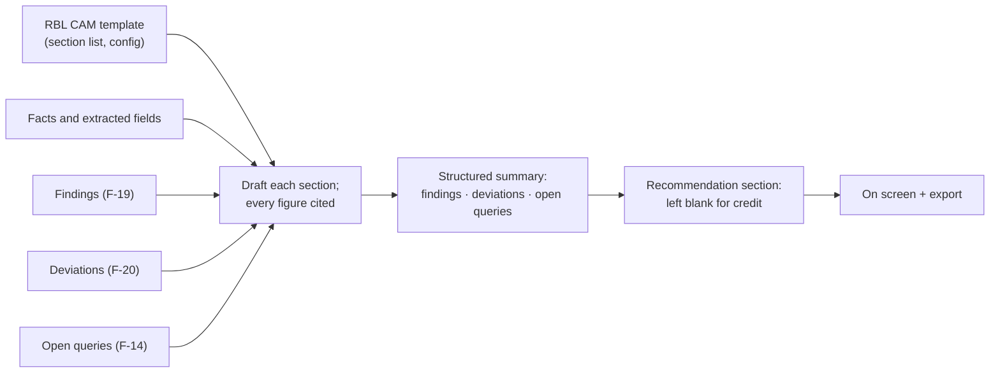

**Requirements**

- **F-23.1** Sections follow RBL's template, held in configuration. Until the template arrives, an interim section list is used.
- **F-23.2** Every quantitative statement carries a citation to its source page. Narrative is written in a neutral analyst register, from facts only.
- **F-23.3** The memo ends with a structured summary of findings (F-19), deviations against policy (F-20) and open queries (F-14).
- **F-23.4** The recommendation section is present and empty, for credit to complete.
- **F-23.5** The memo is viewable on screen with working citations, and exportable. The export format is decision C.4-5.
- **F-23.6** Model-drafted text is recorded and replayed (principle 6).

**Acceptance (TC-28)**
- The reviewer rates the draft usable with minor edits (C8, at least 75% of cases).
- Citations resolve under C7.

### F-24. PD question note

**Goal.** Questions for the personal discussion with the promoter, each tied to its finding.

**Tests.** TC-29 (C8).

**Depends on.** F-19, F-20.

**Requirements**

- **F-24.1** Questions are generated from findings, deviations and unresolved gaps, and ranked by severity.
- **F-24.2** Each question links to its finding and evidence.
- **F-24.3** The note is viewable and exportable alongside the CAM.

**Acceptance (TC-29)**
- The reviewer confirms the questions are relevant.

---

## Phase 8: Evaluation

### F-25. Reference record and comparison

**Goal.** Place CreditIQ's output beside RBL's original record for each case, and let the RBL reviewer adjudicate.

**Tests.** TC-30 (all criteria). Also provides the recorded approval for TC-27.

**Depends on.** F-13, F-14, F-15, F-19, F-20.

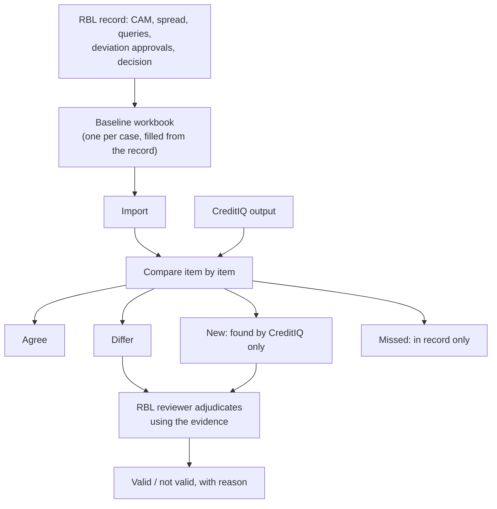

**Screen mock: Comparison tab**

```text
┌ Comparison with RBL record · BBG-2026-000021 ── Agree 41 · Differ 3 · New 4 · Missed 2 ───────────┐
│ Area           Item                        CreditIQ      RBL record    Status                     │
│ Key fields     Turnover FY25 (audited)     4,62,10,000   4,62,10,000   Agree                      │
│ Key fields     Net worth FY25              1,12,40,000   1,10,90,000   Differ ▸                   │
│ Discrepancies  Undeclared EMI, Lender X    Found         —             New ▸  [Valid] [Not valid] │
│ Discrepancies  Stock statement outdated    Found         Found         Agree                      │
│ Queries        Valuation report            Asked         Asked         Agree                      │
│ Queries        Rent agreement              —             Asked         Missed                     │
└───────────────────────────────────────────────────────────────────────────────────────────────────┘
```

**Requirements**

- **F-25.1** Each case's reference record is captured in a baseline workbook: an Excel template with one sheet per area. Areas:
  - document classification;
  - key-field values;
  - discrepancies and observations;
  - queries raised;
  - deviations;
  - approving authority;
  - decision.

  The delivery team fills it from RBL's record, and the RBL reviewer confirms it.
- **F-25.2** Import validates the workbook and attaches it to the case.
- **F-25.3** Items are compared by area and marked agree, differ, new or missed. Every CreditIQ item opens its evidence.
- **F-25.4** For each difference and new finding, the reviewer records valid or not valid, with a reason. Under the test plan's rule, a valid finding the record is silent on counts as valid.
- **F-25.5** Adjudications are recorded overlays. They never change the processed output.

**Acceptance (TC-30)**
- For every case, the comparison is complete, with agreement, differences and new findings marked.

### F-26. Scorecard and test log

**Goal.** Compute C1 to C9 per case and across the case set, and keep the test log.

**Tests.** All criteria. Section 5.4 indicators.

**Depends on.** F-25, F-02.4.

**Requirements**

- **F-26.1** The scorecard shows each criterion per case and across the set:

  | Criterion | Target | Computed from |
  |---|---|---|
  | C1 Classification | At least 90% (routed documents reported separately) | F-09 vs baseline |
  | C2 Completeness | At least 90% | F-13 vs reviewer |
  | C3 Key fields | At least 90% digital, at least 80% scanned | F-15 vs baseline, split by grade |
  | C4 Discrepancy identification | At least 85% | F-19, F-20 vs record |
  | C5 Flag validity | At least 85% | Adjudications |
  | C6 Query coverage | At least 80% | F-14 vs record |
  | C7 Traceability | 90% | F-16 click test |
  | C8 Output fitness | At least 75% of cases | Reviewer rating per case |
  | C9 Processing time | Baseline | F-02.4 timings |

- **F-26.2** Reported indicators:
  - new findings;
  - issues caught at login that the record shows were raised later;
  - review items per case.
- **F-26.3** Test log: every controlled variant is recorded, with the source documents and what was changed. Examples: a renamed file, merged or removed pages, a withheld document. Variants never alter a document's content.
- **F-26.4** For any criterion short of target, the shortfall is attributed to document quality, configuration or capability.
- **F-26.5** The scorecard reconciles to the items in the comparison view. It can be exported.

**Acceptance**
- The scorecard computes every criterion for the case set and reconciles to the comparison items.

### F-27. Live run

**Goal.** Cases are processed end to end on screen, and the time is recorded.

**Tests.** TC-31 (C9).

**Depends on.** All previous features.

**Requirements**

- **F-27.1** The full path runs from the screens alone, without the command line:
  1. new application
  2. upload
  3. documents processed
  4. checklist and queries
  5. extracted data
  6. cross-checks
  7. policy
  8. outputs
  9. comparison
- **F-27.2** Progress is visible per document while processing runs.
- **F-27.3** Elapsed time from upload to draft CAM is recorded per case, excluding human review time (C9).
- **F-27.4** A rehearsal script covers the same path. It is run in full before each session, together with a link crawl (no dead links) and the excluded-terms sweep.

**Acceptance (TC-31)**
- Jointly agreed cases are created, processed and output on screen, and their times are recorded.

---

# Part C: Reference

## C.1 Test traceability

| TC | Test | Features | Criteria |
|---|---|---|---|
| TC-01 | Case from RM email or notes | F-04 | C3 |
| TC-02 | Mobile access | F-06 (with F-04, F-05) | Functional |
| TC-03 | Bulk and ZIP upload | F-05, F-02 | C1 |
| TC-04 | Merged documents | F-08 | C1 |
| TC-05 | Poor-quality documents | F-07 | C1 |
| TC-06 | Classification by content | F-09 | C1 |
| TC-07 | Mislabelled file | F-10 | C1 |
| TC-08 | Document attributed to the wrong person | F-10 | C1 |
| TC-09 | Unrecognised document | F-09, F-17 | C1 |
| TC-10 | Partner outputs | F-11 | C1, C3 |
| TC-11 | Complete file | F-13 | C2 |
| TC-12 | Missing documents | F-13, F-14 | C2, C6 |
| TC-13 | Incomplete documents | F-13 | C2 |
| TC-14 | Outdated documents | F-13 | C2 |
| TC-15 | Checklist by constitution and product | F-12 | C2 |
| TC-16 | Consolidated pre-login query list | F-14 | C6 |
| TC-17 | Identity and registration | F-15 | C3 |
| TC-18 | Financial statements and spread | F-15, F-22 | C3, C8 |
| TC-19 | GST | F-15 | C3 |
| TC-20 | Banking | F-15 | C3 |
| TC-21 | Confidence and evidence | F-16, F-17 | C7 |
| TC-22 | Identity consistency | F-19 | C4, C5 |
| TC-23 | Turnover | F-18, F-19 | C4, C5 |
| TC-24 | Bank accounts | F-18, F-19 | C4, C5 |
| TC-25 | Existing obligations | F-18, F-19 | C4, C5 |
| TC-26 | Policy norms and deviations | F-20 | C4, C5 |
| TC-27 | Approving authority | F-21 | C4 |
| TC-28 | Draft CAM | F-23 | C7, C8 |
| TC-29 | PD question note | F-24 | C8 |
| TC-30 | Comparison with RBL's record | F-25 | All |
| TC-31 | End-to-end live run | F-27 | C9 |

## C.2 Criteria traceability

| Criterion | Produced by | Measured by | Must meet target (test plan 5.5) |
|---|---|---|---|
| C1 Classification | F-05, F-07 to F-11 | F-26 | Yes |
| C2 Completeness | F-12, F-13 | F-26 | Or shortfall explained |
| C3 Key fields | F-04, F-11, F-15 | F-26 | Yes |
| C4 Discrepancies found | F-19, F-20, F-21 | F-26 | Yes |
| C5 Flag validity | F-19, F-20 | F-25, F-26 | Yes |
| C6 Query coverage | F-14 | F-26 | Or shortfall explained |
| C7 Traceability | F-15, F-16 | F-26 | Yes |
| C8 Output fitness | F-22 to F-24 | F-26 | Or shortfall explained |
| C9 Processing time | F-02, F-27 | F-26 | Baseline only |

## C.3 Inputs required from RBL

| Input | Needed by | Interim until received |
|---|---|---|
| BBG document checklist by product and constitution | F-12, F-13 | Published-policy checklist (exists) |
| CAM template (blank) and two or three completed examples | F-23 | Interim section list |
| Spread template (Excel) | F-22 | None: F-22 waits |
| Key BBG policy norms: eligibility, ratios, security cover, documentation, deviation categories | F-20 | Published-policy ratios (exist, provisional) |
| Approval and delegation matrix | F-21 | F-21 not built without it |
| Credit tolerances (for example turnover variance) | F-19 | Delivery-team proposal, marked provisional |
| Permitted document ages | F-13 | Delivery-team proposal, marked provisional |
| Samples of partner GST, bank-statement analysis and bureau outputs | F-11 | None: F-11 waits |
| The case set (seven to eight cases): source documents **and** credit record | F-25 to F-27; all testing | Development uses controlled variants as they become available |
| Final key-field list and tolerances (open points 2 and 3) | F-15, F-19 | Section 5.3 list |

## C.4 Decisions

| # | Decision | Needed before | Status |
|---|---|---|---|
| 1 | Who implements F-07 to F-11 and F-15 | Phase 2 | **Decided 29 Sep 2026:** the vendored ingest engine, as a Node sidecar (AD-2) |
| 2 | Constitutions: the checklist covers private limited, partnership and proprietorship. Add LLP and public limited? | F-12 | Open. Add them if the case set includes either |
| 3 | Development data before RBL's cases arrive | Phase 2 | **Decided 29 Sep 2026:** controlled test documents under `tests/fixtures/TC-xx/`, each with its expected result (AD-6) |
| 4 | Where the model runs for RBL data, and which provider | Phase 2 | Open for RBL data. For development, no model key yet: a stub provider plus recorded responses (AD-5) |
| 5 | CAM export format (Word, PDF, or both) | F-23 | Match RBL's template's native format |
| 6 | Evidence region: page is mandatory (C7). Should the region on the page be shown too? | F-16 | Page for every value; region where cheaply available |
| 7 | Screen structure: the prototype's two case workspaces and 12 case screens, or one workspace in processing order | Screens | **Decided 30 Sep 2026:** one case workspace whose tabs follow §5; the prototype's visual style is kept; the DocReady and Appraisal workspace names are dropped; screens call the record an appraisal (§6) |

## C.5 The base this build starts from

**Status: applied on 29 September 2026.** The repository was cleaned to this document's scope. Everything removed stays in git history at commit `cd6b481`. `npm run check` runs every gate: typecheck, eslint, pytest, the import contract, the excluded-terms sweep and the build.

**Kept**

- **Frontend:**
  - the application shell (top bar, role-gated side navigation, sign-out);
  - the design system (`src/styles.css` and 25 shadcn primitives in `src/components/ui`);
  - `PageHeader` and `EmptyState`;
  - sign-in and session;
  - the workbench case list (`/`), with loading, empty and service-down states;
  - terminology (`terminology/rbl.yaml`, trimmed to PoC vocabulary).
- **Engine:**
  - FastAPI service: health, cases, published configuration (version, policy, checklist taxonomy), sign-in;
  - the case model reduced to the workbench view (F-01.4), with the section 7 case stages;
  - the configuration store: validate, publish, version, diff;
  - the checklist deriver;
  - identifier validators (GSTIN checksum; PAN, CIN, Udyam, IFSC, TAN, DIN, UDIN, ITR formats);
  - the excluded-terms sweep;
  - the command line.
- **Configuration:**
  - `checklist_taxonomy.yaml`;
  - `policy.yaml` (seven ratios, all marked provisional until RBL's norms arrive);
  - `roles.yaml` (RM, Credit Analyst, Credit Manager; one user each).
- **Tests:**
  - identifiers, checklist and config store (15 pytest tests);
  - the import-linter contract, which now also covers the config reader, identifiers and config loader.
- **Data root** (`workflow/data`, never committed):
  - `cases/` at mode 700 for RBL case files;
  - `config_store/` (the published versions);
  - `audit/`.

  The empty `sample/`, `corpus/` and `real/` folders were removed.

**Removed, as out of scope or not functional**

- **Screens:**
  - admin: templates, policy, connectors, users;
  - Account Aggregator data and consent;
  - rating;
  - submission;
  - memo library;
  - audit;
  - the exception queue placeholder;
  - the DocReady console and its tabs (including the customer portal);
  - the borrower, entity and person dossiers;
  - the placeholder case-step screens;
  - the copilot rail;
  - top-bar search and notifications;
  - the mock "new application" form.
- **Frontend data:** static seed and mock modules (`src/data/*`) and the unused deployment-feature flags.
- **Unused components:** the document viewer, memo citation, identity chips and unused UI primitives.

  The pdf.js document viewer (`src/components/docviewer/` at `cd6b481`) is a useful starting point for F-16.
- **Sample data:** the synthetic sample-case generator (`engine/samplegen`), the two sample case descriptors and their per-case dictionaries, and the legacy document generator (`scripts/docgen`, which depended on an AGPL library).
- **Endpoints:** the users, roles and per-case dictionary endpoints, which were unauthenticated and unused.
- **Configuration:**
  - the internal rating grid (rating is out of scope);
  - narrative policy notes not sourced from RBL;
  - the Chief Credit Officer, Administrator and Compliance roles and their users.
- **Dependencies:**
  - Python: `reportlab`, `pypdf` and `jsonschema` (lockfile recompiled);
  - npm: 21 packages used only by the removed primitives, charts and the viewer.
- **Leftover references:** code comments that cited the superseded plans and stages, and fixed identifier tables used only for generating fictional cases.

## C.6 Architecture decisions

Decided 29 September 2026. A change to any of these is recorded here with its date and reason.

| # | Decision | Reason |
|---|---|---|
| AD-1 | **Screens keep the prototype's visual style, re-fed with real data; the structure follows §6** (amended 30 Sep 2026, decision C.4-7). Screen content is restored from the prototype source (git `6014167`) where it exists, keeping its components and look, and placed in the tab of the stage it belongs to. Its seeded data module is replaced by typed hooks over the engine API. Seeded values never return; every screen has designed loading, empty and error states. | RBL has seen this design. The test plan measures behaviour, so reusing the layout costs nothing and keeps the demo continuity. |
| AD-2 | **Document processing (F-07 to F-09, F-11, F-15) is the vendored ingest engine** (`services/ingest-engine`, a Node/TypeScript sidecar), extended per its `VENDORED.md`. The CreditIQ engine calls it over HTTP through one client module and never parses documents itself. The sidecar reads the published CreditIQ configuration (document types, dictionaries, thresholds) and echoes the version it used. | The user chose to vendor rather than port. One client module keeps the boundary narrow and testable. |
| AD-3 | **SQLite (Python standard library) under the data root** holds cases, the document register, jobs, evidence, findings, queries, review decisions and the decision log. Files are stored by SHA-256 under `cases/<id>/files/`. | Simple and inspectable; survives restarts; no server to run. |
| AD-4 | **The API contract is defined first and generated.** Pydantic models in `engine/contracts/` are the single source. The sidecar's result schema is `contracts/ingest-result.schema.json`, generated from the same models. TypeScript types are generated from the engine's OpenAPI into `src/api/schema.gen.ts` (`npm run gen:api`). Hand-written mirrors are removed. | Parallel streams build against one fixed interface and cannot drift. |
| AD-5 | **Model layer:** one provider interface with Anthropic (default) and Gemini, both native. Every call is recorded, and replayed by the hash of its canonical request. No sampling parameters are sent. Until a key is supplied, a stub provider serves recorded responses, and a miss is an explicit error, never a guess. | Deterministic re-runs (principle 6) and a reproducible scorecard. |
| AD-6 | **Every feature ships with fixtures and tests tagged by test case.** Fixtures live in `tests/fixtures/TC-xx/`, each with an expected result. There are pytest suites for the engine, `node:test` for the sidecar, and Playwright (including 375 px) for screens. The scorecard (F-26) runs from the first extraction. `npm run check` gates every merge. | Keeps every wave measured against C1 to C9. |

**Build organisation.**

- **Wave 0, foundation (sequential):** F-00 to F-03, the contract (AD-4) and the prototype shell.
- **Wave 1, three parallel streams**, each on its own branch and git worktree, merged after review:
  - document processing in the sidecar: F-07 to F-09, F-11 and F-15;
  - intake and completeness in the engine: F-04, F-05, F-10, F-12 to F-14 and F-17;
  - screens: restoring and rewiring the prototype screens, F-06 and F-16.
- **Wave 2, triangulation and policy:** F-18 to F-21.
- **Wave 3, outputs:** F-22 to F-24.
- **Wave 4, evaluation:** F-25 to F-27.

Each wave ends with a sign-off.
